# 🪚 Выравнивание корпуса

### 01. Ставим принтер на поверочную плиту

После наживления всех винтов ставим принтер на поверочную плиту.

<figure>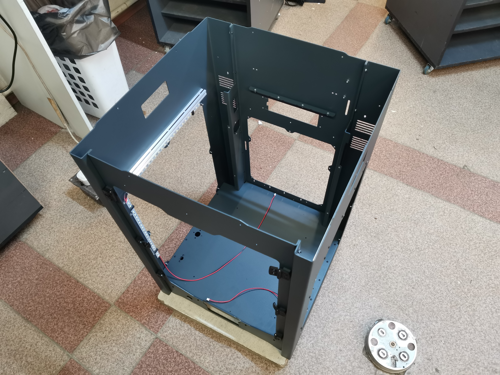<figcaption></figcaption></figure>

### 02. Выравниваем верх

&#x20;Далее необходимо выравнить корпус в этих местах:

<figure>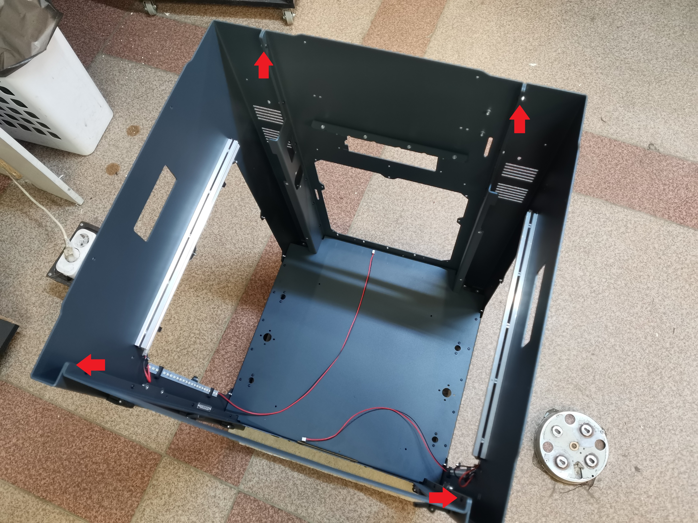<figcaption></figcaption></figure>

Тут выравниваем боковые стенки и переднюю стенку так, как показано на фото и зажимаем верхние винты:

<figure>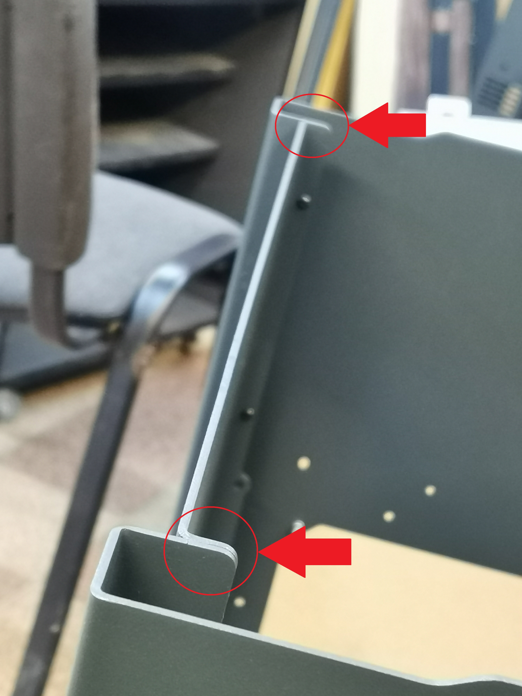<figcaption></figcaption></figure>

Тут выравниваем боковые стенки и заднюю стенку так, как показано на фото и зажимаем верхние винты:

<figure>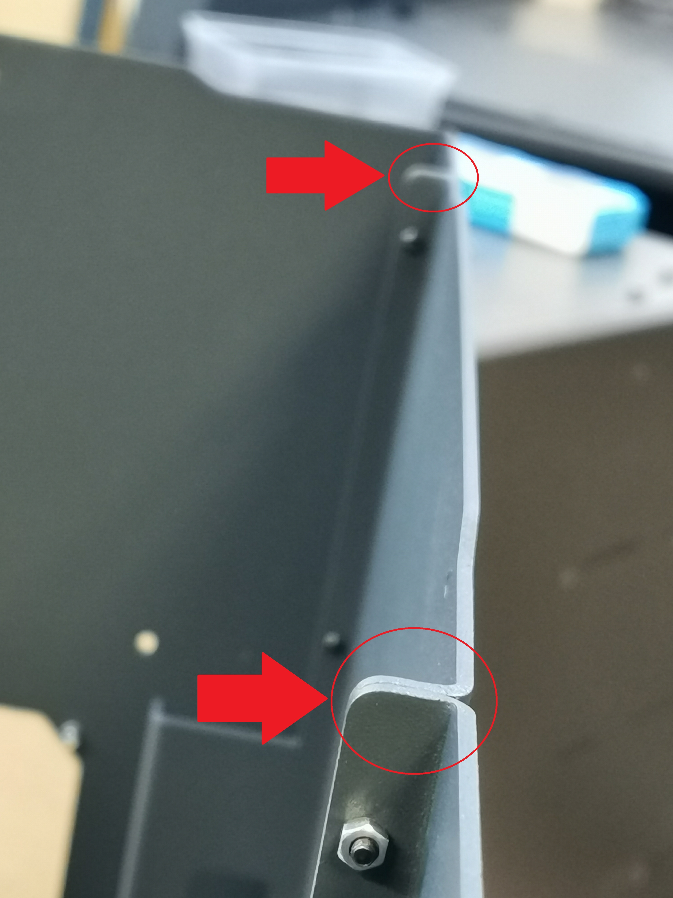<figcaption></figcaption></figure>


<mark style="color:red;">**ВНИМАНИЕ! ТАК БЫТЬ НЕ ДОЛЖНО!**</mark>

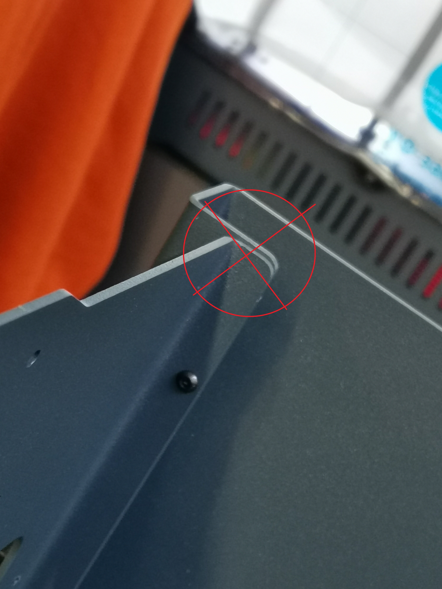


### 03. Выравниваем низ

Кладем принтер на заднюю стенку и выравниваем в этих местах:

<figure><figcaption></figcaption></figure>

Тут выравниваем боковые стенки и переднюю стенку так, как показано на фото и зажимаем нижние винты:

<figure>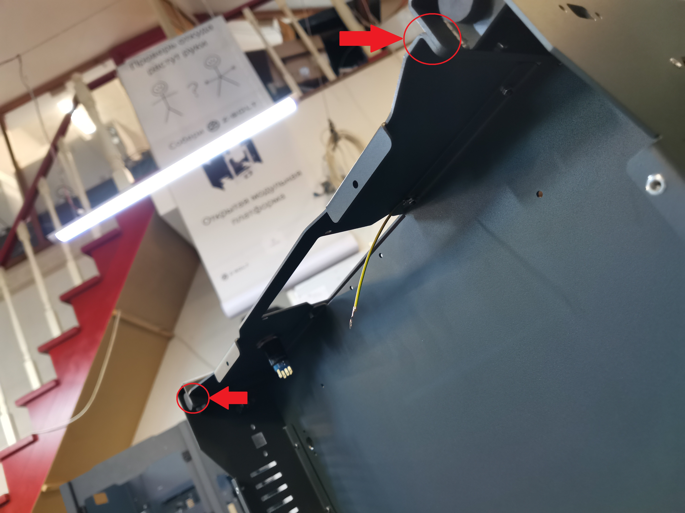<figcaption></figcaption></figure>

Тут выравниваем боковые стенки и заднюю стенку так, как показано на фото и зажимаем нижние винты:

<figure>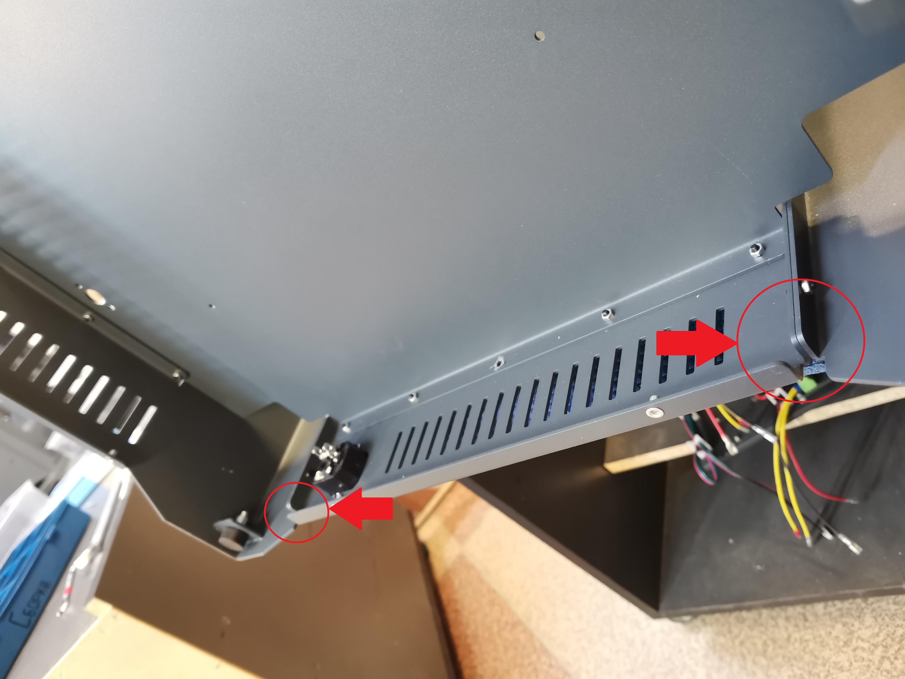<figcaption></figcaption></figure>

### 04. Выравниваем плоскости

Выравниваем переднюю стенку и боковые стенки как показано на фото и фиксируем все оставшиеся винты, соединяющие боковые, переднюю и заднюю стенки:

<figure>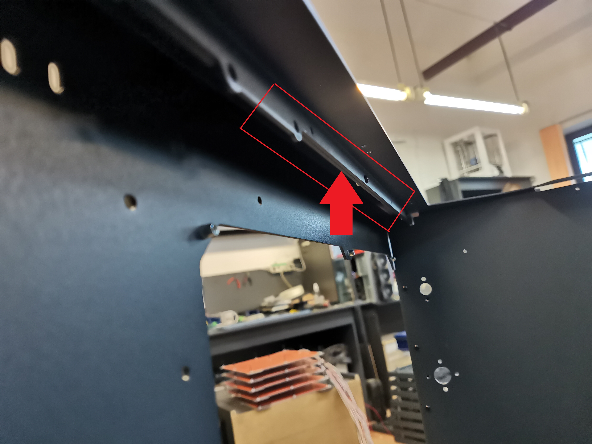<figcaption></figcaption></figure>

### 05. Выставление дна

Фиксируем винты, фиксирующие дно к боковым стенкам по бокам:

<figure>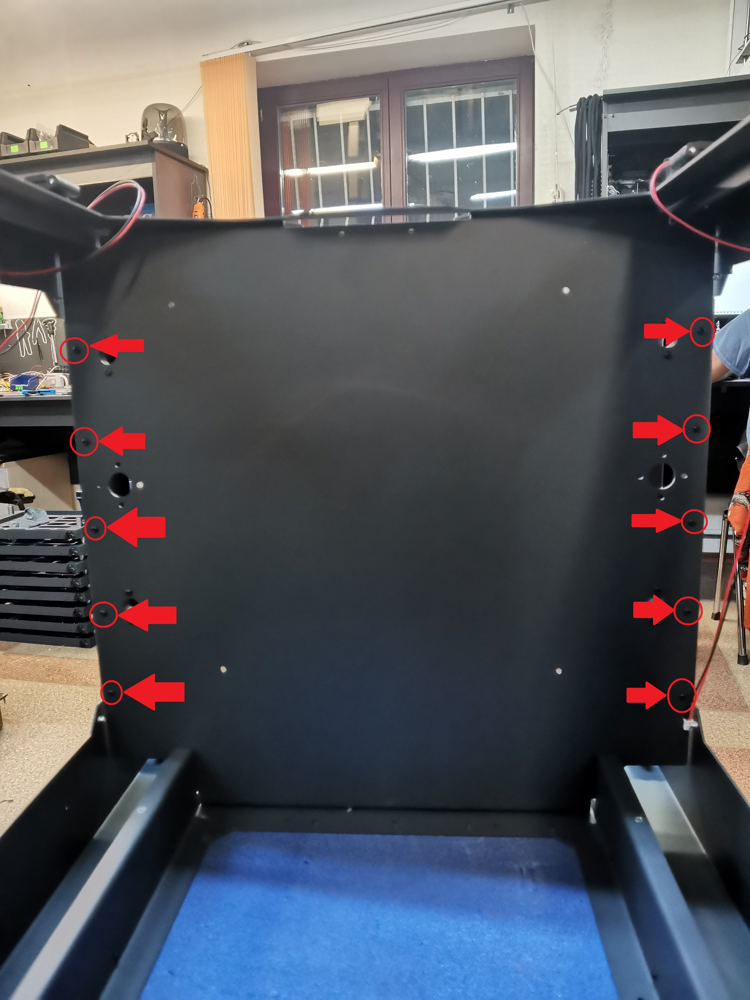<figcaption></figcaption></figure>


**При фиксации дна смотрим, чтобы его гибы не выступали в прорези экрана на передней стенке!**

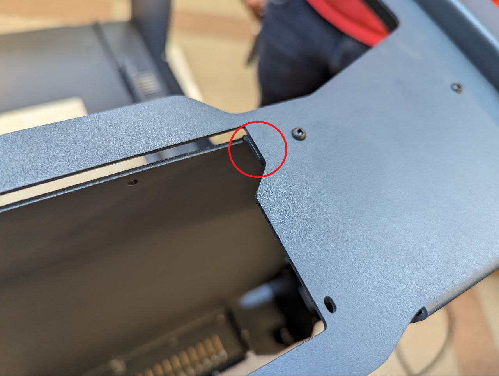

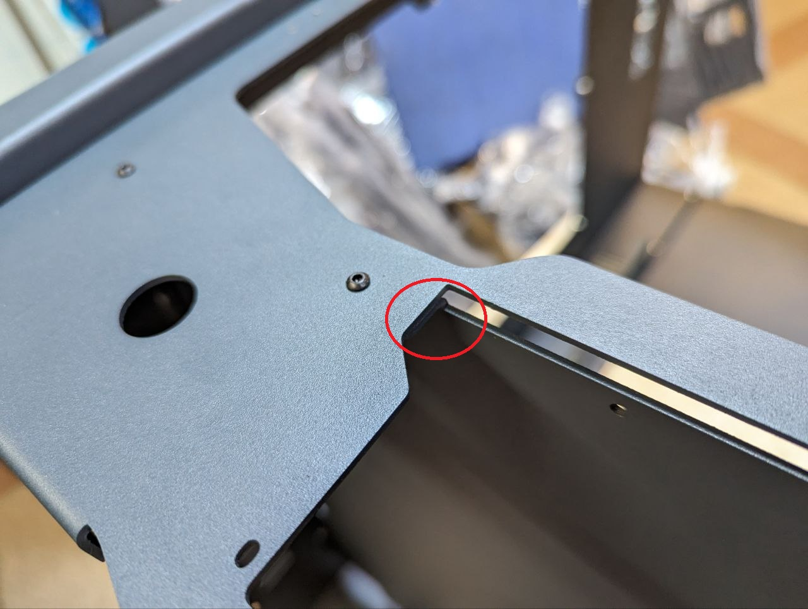


Далее берем друга и оснастку в виде "ровного" профиля, прикладываем к дну и прижимаем его, чтобы выровнять изгиб дна.

Прижимаем сверху и зажимаем винты, крепящие дно к передней стенке:

<figure>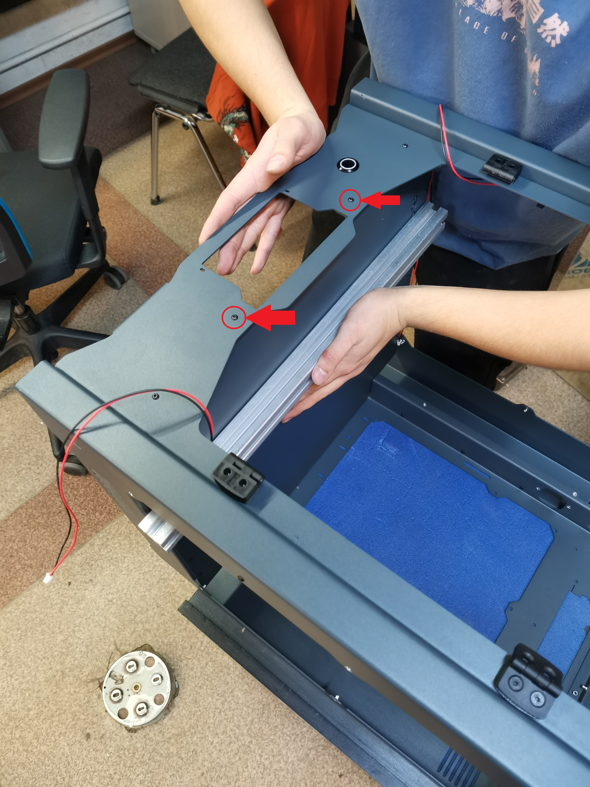<figcaption></figcaption></figure>

Прижимаем снизу и зажимаем винты, крепящие дно к задней стенке:

<figure>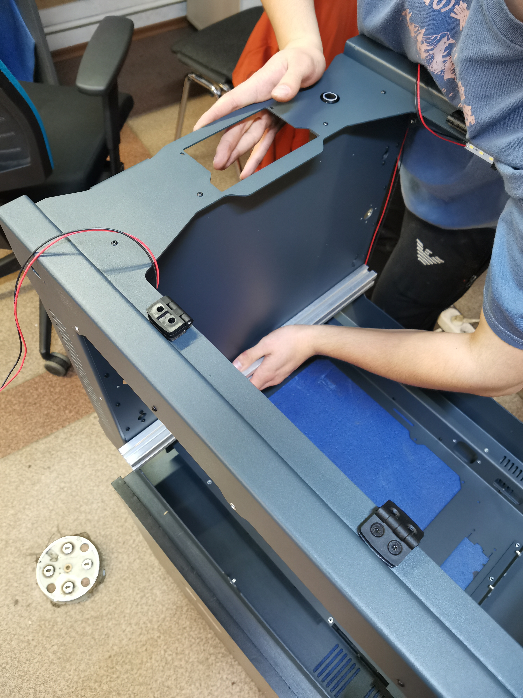<figcaption></figcaption></figure>

<figure><figcaption></figcaption></figure>

После чего зажимаем оставшиеся винты крепления дна.
