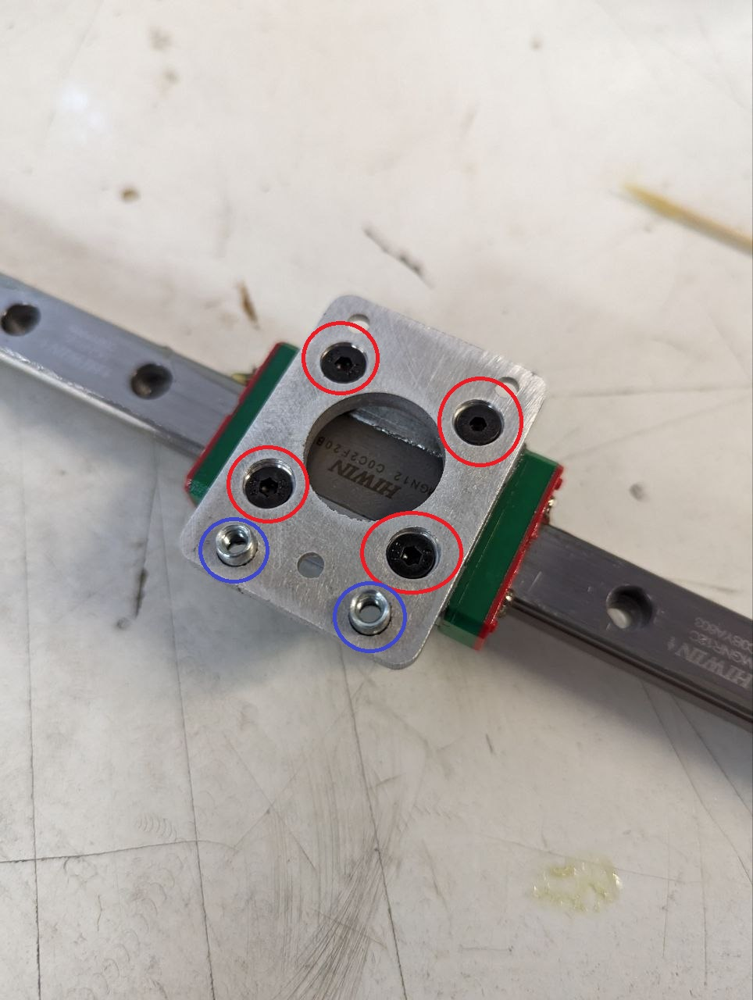
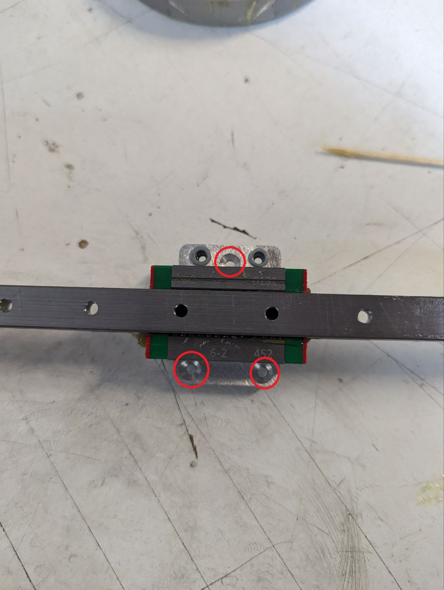
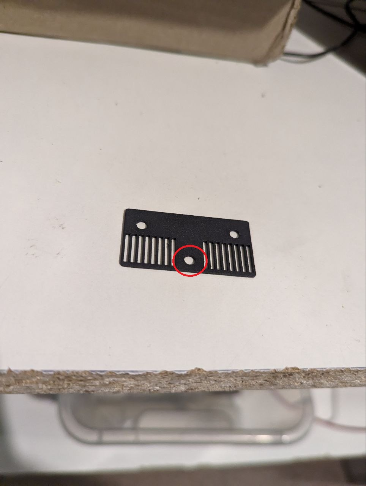
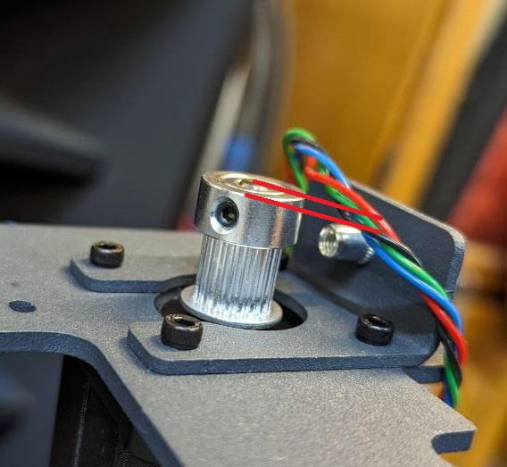
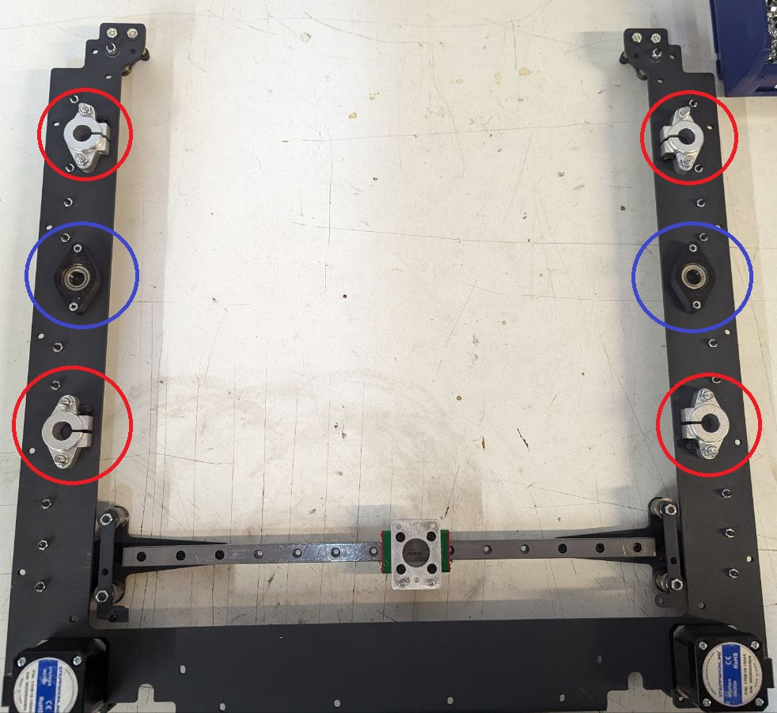
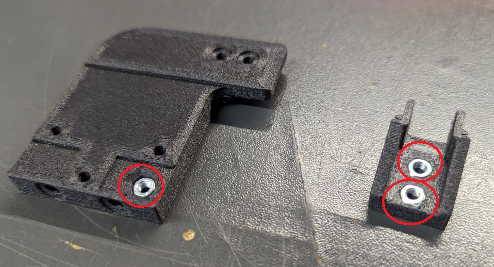
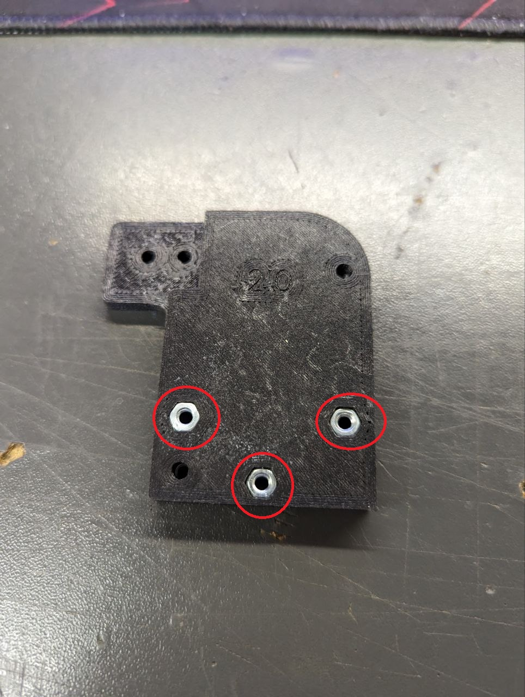
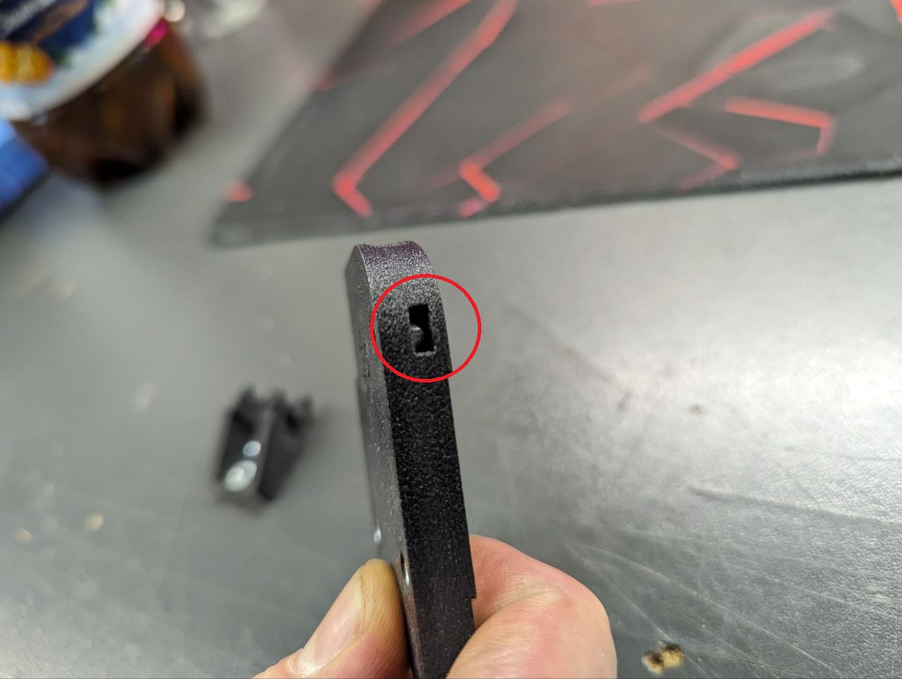
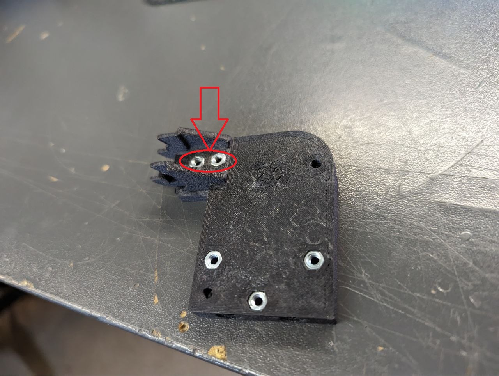

# 🎚️ Сборка портала

## 00. Перечень компонентов

<table data-full-width="true"><thead><tr><th width="433.3333333333333">Наименование</th><th width="248">Фото</th><th>Кол-во на портал</th></tr></thead><tbody><tr><td>Основание портала</td><td></td><td>1</td></tr><tr><td>Натяжители двигателя</td><td></td><td>2</td></tr><tr><td>Двигатели (для S300 и Dual)</td><td></td><td>2</td></tr><tr><td>Двигатели (для HT)</td><td></td><td>2</td></tr><tr><td>Кронштейны оси X</td><td></td><td>2</td></tr><tr><td>Алюминиевый кронштейн оси X</td><td></td><td>1</td></tr><tr><td>Кронштейны микроюнита обводных подшипников</td><td></td><td>2</td></tr><tr><td>Алюминиевая проставка каретки 2 мм</td><td></td><td>1</td></tr><tr><td>Алюминиевая проставка каретки 4 мм</td><td></td><td>2</td></tr><tr><td>Ответная часть кронштейна оси X</td><td></td><td>2</td></tr><tr><td>Лапка концевика Y</td><td></td><td>1</td></tr><tr><td>Верхние подшипники винтов Z (вставлен подшипник 6900ZZ и 2 шестигранные гайки М3)</td><td></td><td>2</td></tr><tr><td>Рельсы MGN12</td><td></td><td>3</td></tr><tr><td>Подшипники</td><td></td><td>624ZZ (без фланца) - 8 шт.       F624ZZ (с фланцем) - 12 шт.</td></tr><tr><td>Фиксатор резьбы</td><td></td><td>1 тюбик</td></tr><tr><td>Верхние фиксаторы валов</td><td></td><td>4</td></tr><tr><td>Лапка концевика X (для S300 и HT)</td><td></td><td>1</td></tr><tr><td>Лапка концевика X (для Dual)</td><td></td><td>1</td></tr><tr><td>Прижимная пластика ремня</td><td></td><td>1</td></tr><tr><td>Ремень 9 м</td><td></td><td>2415 мм 2GT (для HT версии используется высокотемпературный ремень LL-2GT)</td></tr></tbody></table>

## 01. Подготовительные операции

1. Заклепываем резьбовые заклепки М4 в детали натяжителей двигателей (2 шт на портал):

<figure><figcaption></figcaption></figure>

2. Подготавливаем алюминиевые проставки кареток и кронштейн оси X:

* проставки шлифуем
* кронштейн зенкуем и заклепываем резьбовые заклепки М3:


Выделено красным - зенкуем

Выделено синим - заклепываем резьбовую заклепку М3


<figure><figcaption></figcaption></figure>

<figure><figcaption></figcaption></figure>

3. Берем прижимную пластину ремня и зенкуем под потай:

<figure><figcaption></figcaption></figure>

4. Смазываем каретки консистентной смазкой:

<figure><figcaption></figcaption></figure>

5. Надеваем каретки на рельсы с помощью пластикого кондуктора (надеваем аккуратно, чтобы шарики не выскочили):

<figure><figcaption></figcaption></figure>

## 02. Сборка микроюнитов портала

### 01. Собираем балку оси X:


На портале собирается 2 микроюнита, они зеркальны друг друга (но на левой ставится лапка концевика X). **Внимательно смотреть на направление ушек пронштейнов!**


1. Собранный кронштейн:

<figure><figcaption>
Левый кронштейн
</figcaption></figure>

<figure><figcaption>
Правый кронштейн
</figcaption></figure>

<figure><figcaption></figcaption></figure>

### 02. Собираем микроюнит обводных подшипников портала


На портале собирается 2 микроюнита, они зеркальны друг друга.


1. Собранный микроюнит:

<figure><figcaption></figcaption></figure>

<figure><figcaption></figcaption></figure>

<figure><figcaption></figcaption></figure>

2. Для сборки одного микроюнита понадобится:

* кронштейн микроюнита обводных подшипников - 1 шт.
* подшипник 624ZZ - 1 шт.
* подшипник F624ZZ - 2 шт.
* латунная стойка M4x17 - 2 шт.
* шестигранные гайки М4 - 2 шт.
* шайба М4 - 2 шт.
* винт M4x10 DIN912 - 2 шт.
* самоконтрящаяся гайка М4 - 1 шт.
* винт M4x30 ISO7380 - 1 шт.

3. Собираем микроюнит:

* берем кронштейн микроюнита обводных подшипников и прикручиваем к нему 2 латунных стойки винтами М4х10 DIN912
* вставляем винт М4х30 ISO7380
* далее со стороны стоек на винт, вставленный выше надеваем шайбу М4 -> подшипник F624ZZ фланцем к кронштейну -> подшипник 624ZZ -> подшипник F624ZZ фланцем от кронштейна -> шайба М4
* далее надеваем эту конструкцию на основание портала
* прикручиваем торчащий винт М4х30 ISO7380 самоконтрящейся гайкой M4
* прикручиваем латунные стойки шестигранными гайками М4

Данные операции проводить для левого и правого микроюнита <mark style="color:red;">(</mark><mark style="color:red;">**они собираются зеркально! смотреть фото выше!**</mark><mark style="color:red;">)</mark>

## 03. Сборка портала

1. Устанавливаем двигатели с натяжителями на основание портала так, как на фото и фиксируем их винтами М3х12 DIN912 (разъем двигателя в случае S300 и Dual или провода в случае HT должны смотреть наружу портала:


Верхней стороной портала считается сторона, в которую согнута задняя упорная пластина.


<figure><figcaption>
Двигатель для S300 и Dual
</figcaption></figure>

<figure><figcaption>
Двигатель для HT
</figcaption></figure>

2. Выставляем шпули в один уровень с помощью шайбы как на фото:

<figure><figcaption></figcaption></figure>


Для HT, так как двигатели другие, шпуля должна быть чуть-чуть ниже плоскости вала двигателя:



2. Фиксируем шпули на валу двигателя (один установочный винт смазывается в фиксаторе резьбы и прикручивается перпендирулярно плоскости фаски на валу двигателя):

<figure><figcaption></figcaption></figure>

Данные операции проводятся для левого и правого двигателя.

3. Устанавливаем рельсы оси Y с установленными каретками:

<figure><figcaption></figcaption></figure>

4. Крепим рельсы оси Y винтами M3x12 DIN912 и шестигранными гайками М3 (просто наживляем, чтобы рельса имела ход относительно основания портала):

<figure><figcaption></figcaption></figure>

5. Кладем на каретки алюминиевые проставки кареток 4 мм:

<figure><figcaption></figcaption></figure>

6. На проставки кладем собранную балку оси X:


Кронштейн с лапкой концевика X должен смотреть внутрь портала!


<figure><figcaption></figcaption></figure>

<figure><figcaption></figcaption></figure>

7. Наживляем балку винтами М3х12 DIN912 через шайбы М3, кроме места, где устанавливается лапка концевика Y (там теже винты, но без шайб):

<figure><figcaption>
Крепление слева
</figcaption></figure>

<figure><figcaption>
Крепление справа с лапкой концевика Y
</figcaption></figure>


**Для Dual лапка концевика Y ставится в обратную сторону!**


8. После установки балки оси X зажимаем винты крепления балок оси Y:

* сначала отводим балку вверх и фиксируем по одному винту с каждой стороны возле балки.
* далее опускаем вниз и также фиксируем по одному винту с каждой стороны
* после чего фиксируем оставшиеся винты крепления рельс оси Y/

9. Устанавливаем верхние подшипники винтов Z и фиксаторы валов как на фото:


<mark style="color:red;">**Красным**</mark> - фиксаторы валов (винтом M5x20 DIN7420 и шестигранной гайкой М5)

.png>)

<mark style="color:blue;">**Синим**</mark> - верхние подшипники винтов Z (винтами М3х12 ISO7380)


<figure><figcaption></figcaption></figure>

10. Подготавливаем печатные детали держателя косы (запрессовываем шестигранные гайки М3):

<figure><figcaption></figcaption></figure>

<figure><figcaption></figcaption></figure>

<figure><figcaption></figcaption></figure>

11. Прикручиваем деталь косы к держателю (винт М3х8 ISO7380):

<figure><figcaption></figcaption></figure>

12. Берем ремень и протягиваем через подшипники и шпули (один конец остается там, где надпись "Начало", после чего по стрелкам проводим ремень, второй конец должен выйти там, где надпись "Конец":

<figure><figcaption></figcaption></figure>

13. Приклеиваем суперклеем ремень к прижимной пластине ремня:

<figure><figcaption></figcaption></figure>

Клеим сначала с одной стороны так, чтобы одна прорезь в прижимной платине оставалась пустой:

<figure><figcaption></figcaption></figure>

Далее второй конец ремня также как и первый:

<figure><figcaption></figcaption></figure>

14. Прикручиваем прижимную пластину к печатной детали:


Там где зенковка - M3x8 ISO7991

Там где 2 оставшихся отверстия - М3х10 ISO7380


<figure><figcaption></figcaption></figure>

<figure><figcaption></figcaption></figure>

**Поздравляю! Портал собран!**
