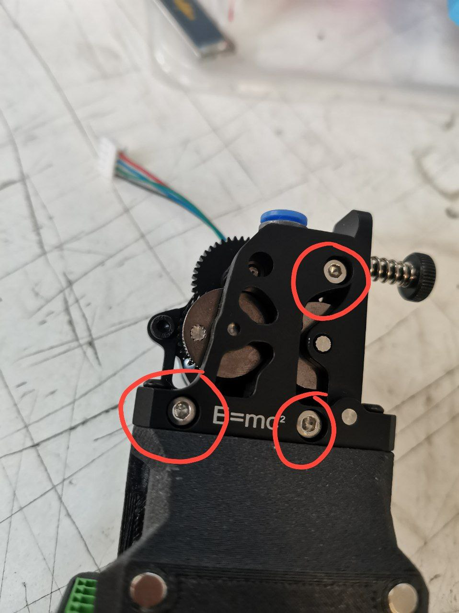
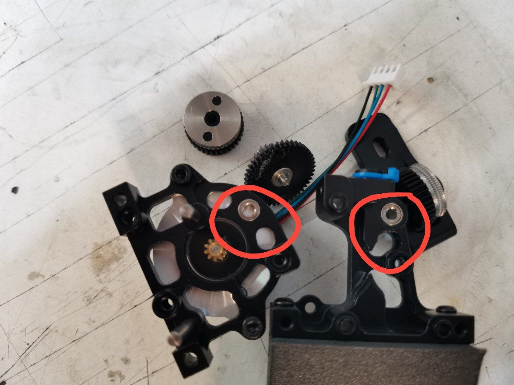
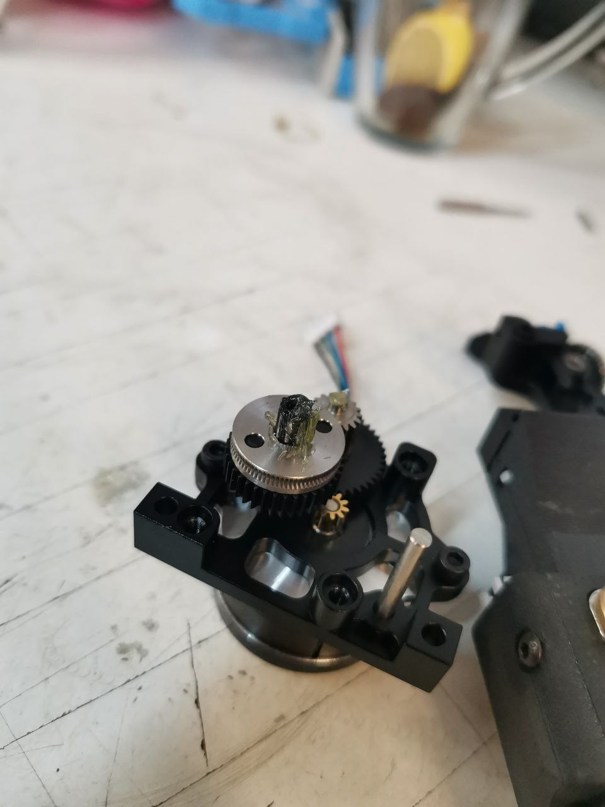
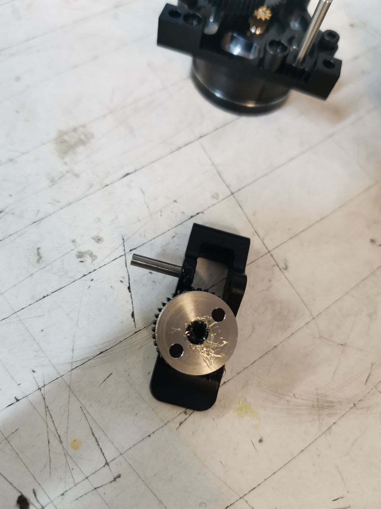
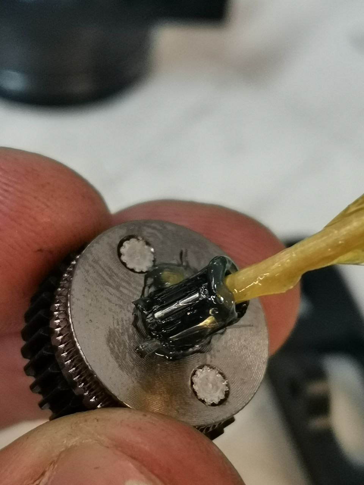

# 🥃 Смазка подвижных частей

Чтобы разобрать экструдер, необходимо открутить 3 винта M3x30 DIN 912, как на фото:

<figure><figcaption></figcaption></figure>

Снимаем шестерни с посадочных мест:

<figure><figcaption></figcaption></figure>

Смазываем подшипники:

<figure><figcaption></figcaption></figure>

Выпрессовываем вал из лапки экструдера и извлекаем шестерню:

<figure><figcaption></figcaption></figure>

Достаем игольчатые подшипники и смазываем их изнутри и снаружи:

<figure><figcaption></figcaption></figure>

Собираем все в обратном порядке.

Проверяем экструдер на отсутствие закузываний путем прокручивания ведущей шестерни.
