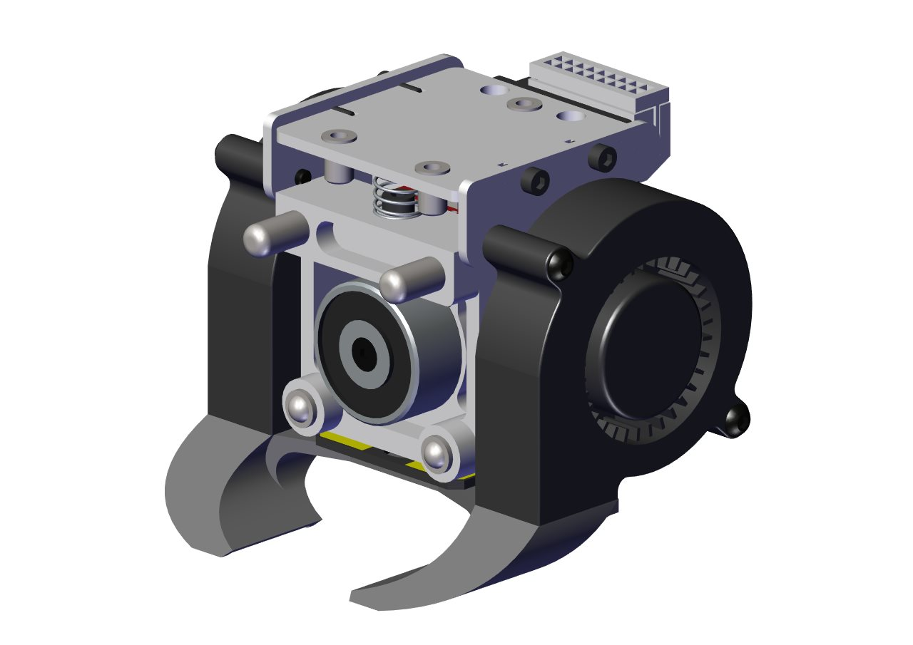
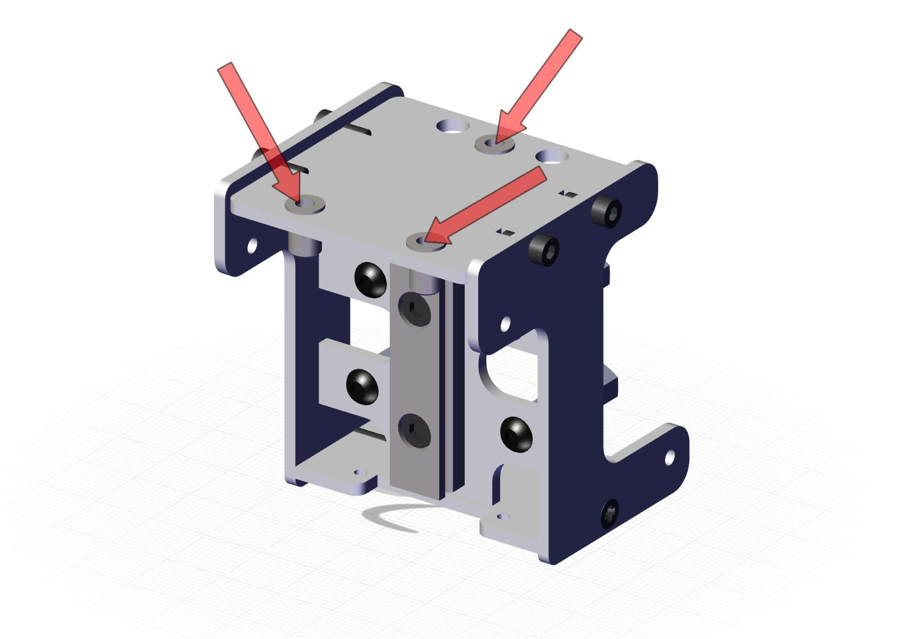
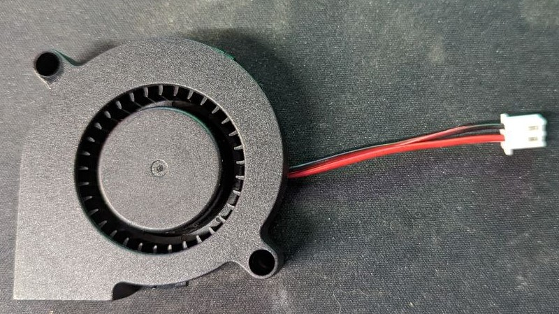
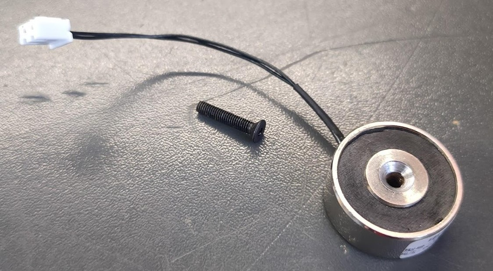
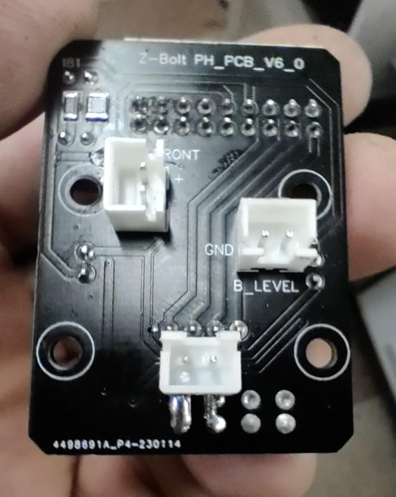
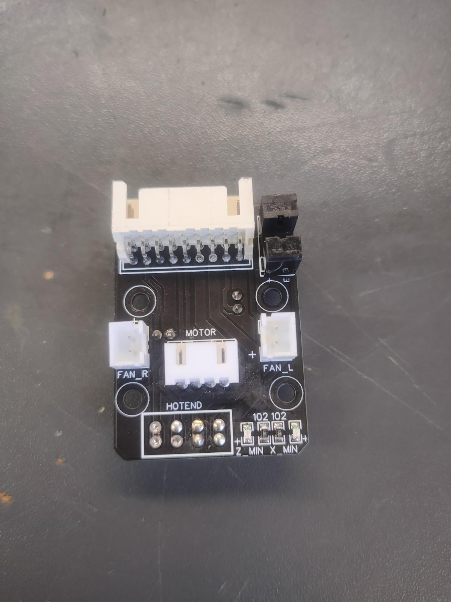
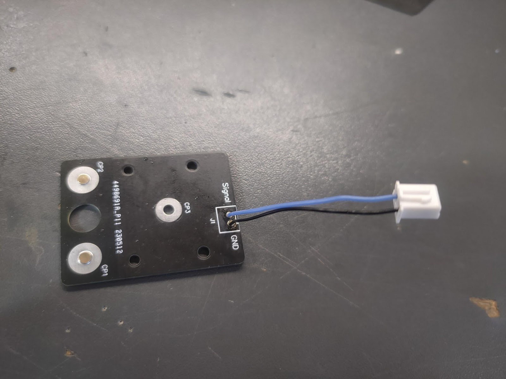

# 🎚️ Сборка каретки

<figure><figcaption></figcaption></figure>

## 01. Подготовка

**Подготовка каркаса:**

* запрессовываем резъбовые заклепки М3 (<mark style="color:red;">**красные стрелки**</mark>).

<figure><figcaption></figcaption></figure>

<figure><figcaption></figcaption></figure>

* нарезаем резъбу М2.5 (<mark style="color:red;">**красные стрелки**</mark>):&#x20;

<figure><figcaption></figcaption></figure>

* нарезаем резъбу М3 (<mark style="color:red;">**красные стрелки**</mark>):&#x20;

<figure><figcaption></figcaption></figure>

* прикручиваем рельсу MGN9R длиной 40 мм к каркасу винтами M3x10 DIN 912 и гайками M3 самоконтр, выставляем ее с помощью оснастки (лежит в тумбе Dual):


<mark style="color:red;">**ВНИМАНИЕ!**</mark>

Если каркас крашенный, то нужно зачистить дремелем место под гайкой крепления рельсы!

.png>)


<figure><figcaption></figcaption></figure>

* прикручиваем нейлоновые стойки M3x20 (беруться в тумбеDual) винтами M3x8 ISO 7380 и садим на фиксатор резъбы.

<figure><figcaption></figcaption></figure>

**Подготавливаем вентиляторы обдува:**

* берем 2 5015 вентилятора и укорачиваем провода до 50 мм.
* зачищаем и обжимаем провода в XH2.54 как на фото:

<figure><figcaption></figcaption></figure>

**Подготавливаем держатель печатных голов:**

<figure><figcaption></figcaption></figure>

1. Зенковка М3 (для педантов Ø6.8).


Проверяем, чтобы шляпка потайного винта была полностью утоплена в зенковку!


1. Резьба М3. В резьбу сверху закручиваем М3х6 DIN 912 (на рисунке не показано).


Если резьба под магнитом сорвется - можно запрессовать латунную гайку.


3. Запрессовываем пиптыки.


Если отверстий нет - сверлим сверлом Ø1.9мм на расстоянии 22мм друг от друга симметрично относительно центра. Пиптыки кладем шляпкой на стол и молотком заминаем его ножку, после чего вставляем их в отверстия и вбиваем молотком.


4. Запрессовываем подпружиненные шарики.


Если шарики выпадают, то садим на суперклей.


5. Запрессовываем рога.


Если рога болтаются в отверстии, то аккуратно сзади керним по линии прилегания вала и алюминия.&#x20;

Если не лезут совсем, можно развернуть отверстия специальной разверткой 6мм на ⅘ длины, а в оставшиеся \~5мм допрессовать в тисках.


**Подготавливаем электромагнит:**

* зенкуем М3 (для педантов Ø6.8):


Проверяем зенковку с помощью потайного винта, чтобы шляпка не торчала из электромагнита.

**После зенковки снимаем фаску!**


<figure><figcaption></figcaption></figure>

* укорачиваем провода до 80 мм.
* зачищаем и обжимаем провода в XH2.54 (полярность не важна).

<figure><figcaption></figcaption></figure>

*   изготаливаем кастомный винт M3x13.5/14 DIN 7991:

    * прикручиваем электромагнит к держателю печатных голов винтом M3x16 DIN 7991:

    <figure><figcaption></figcaption></figure>

    * стачиваем остаток винта с обратной стороны вровень с держателем:

    <figure><figcaption></figcaption></figure>

**Подготавливаем печатную плату:**

В плате коммутации нагреваем феном и выпаиваем разъем хотэнда (или не запаиваем изначально, если паяем самостоятельно). На его место с внутренней стороны к контактным площадкам нагревателя планарно припаиваем угловой XH2.54. Должно получиться так:

<figure><figcaption>
Вид внутри
</figcaption></figure>

<figure><figcaption>
Вид снаружи
</figcaption></figure>

В плате автоуровня вместо разъема припаиваем провода от двигателей экструдера или от вентиляторов длиной 5 см и обжимаем в XH2.54:

<figure><figcaption></figcaption></figure>

## 02. Сборка

1. Одеваем каретку MGN9H на рельсу, затем через печатную проставку крепим плату автоуровня - М3х10 ISO 7380:

<figure><figcaption></figcaption></figure>

<figure><figcaption></figcaption></figure>

2. Крепим держатель печатных голов винтами М3х6 iso 7991 - 4шт и электромагнит винтами М3х13.5 DIN 7991 (кастомный).


При установке магнита необходимо смазать термопастой место соприкосновения магнита и алюминиевой детали!


<figure><figcaption></figcaption></figure>

<figure><figcaption></figcaption></figure>

3. Устанавливаем пружинку Ø7\*0.6\*14мм (та же, что используется на парковке).

<figure><figcaption></figcaption></figure>

4. Вставляем разъемы с внутренней стороны платы (автоуровень в автоуровень и магнит в припаяный на место хотэнда угловой XH2.54), крепим плату на 4 винта М3х6 ISO 7380.
5. Ставим вентиляторы обдува М3х18 ISO 7380 - 4шт. (для винтов, которые ближе к пружине нужно поставить шайбы М3 между вентилятором и каркасам, чтобы винты не упирались в держатель).
6. Прикручиваем печатный обдув винтами M2.5x8 DIN 912 - 2 шт.
