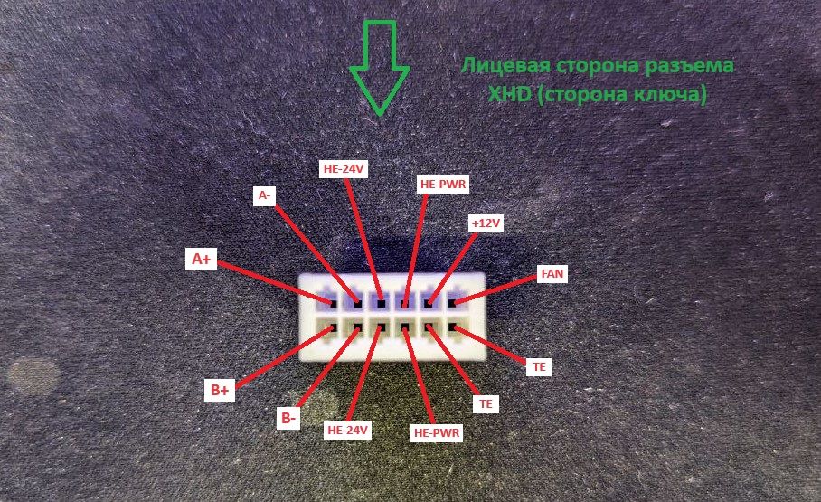
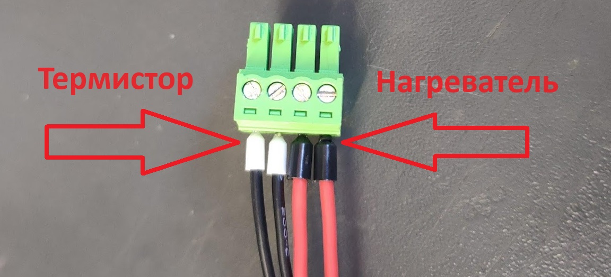

# 🪡 Сборка кос для Ext.PCB v3


**ВНИМАНИЕ! ВСЕ КОСЫ С 29.08.2024**


## Подготовка проводов



Длина проводов - 2050 мм.

Провод 20AWG - 2 шт. на 1 косу (нагреватель)

Длина проводов - 2050 мм.

Провод 24AWG - 6 шт. на 1 косу (термистор, двигатель)

Длина проводов - 2110 мм.

Провод 24AWG - 2 шт. на 1 косу (вентилятор)



Длина проводов - 1750 мм.

Провод 20AWG - 2 шт. на 1 косу (нагреватель)

Длина проводов - 1750 мм.

Провод 24AWG - 6 шт. на 1 косу (термистор, двигатель)

Длина проводов - 1810 мм.

Провод 24AWG - 2 шт. на 1 косу (вентилятор)



## Обжимка проводов



**Провода нагревателя:**

* 20AWG 2 шт. 2050 мм
* Обжимаем с одной стороны в черные НШВИ, с другой в XHD
*

    <figure><figcaption></figcaption></figure>

**Провода термистора:**

* 24AWG 2 шт.  2050 мм.
* обжимаем с одной стороны в белые НШВИ, с другой в XHD
*

    <figure><figcaption></figcaption></figure>

**Провода вентилятора:**

* 24AWG 2 шт. 2110 мм
* обжимаем с одной стороны в XH2.54-2pin (сразу вставляем их в разьемы), с другой в XHD
*

    <figure><figcaption></figcaption></figure>

**Провода двигателя экструдера:**

* 20AWG 4 шт 2050 мм
* обжимаем с одной стороны в MMF 4 pin Мама, с другой в XHD
*

    <figure><figcaption></figcaption></figure>



**Провода нагревателя:**

* 20AWG 2 шт. 1750 мм;
* Обжимаем с одной стороны в черные НШВИ, с другой в XHD;
*

    <figure><figcaption></figcaption></figure>

**Провода термистора:**

* 24AWG 2 шт. 1750 мм;
* обжимаем с одной стороны в белые НШВИ, с другой в XHD;
*

    <figure><figcaption></figcaption></figure>

**Провода вентилятора:**

* 24AWG 2 шт. 1810 мм;
* обжимаем с одной стороны в XH2.54-2pin, с другой в XHD;
*

    <figure><figcaption></figcaption></figure>

**Провода двигателя экструдера:**

* 20AWG 4 шт. 1750 мм;
* обжимаем с одной стороны в MMF 4 pin Мама, с другой в XHD;
*

    <figure><figcaption></figcaption></figure>



## Сборка косы


Схема подключения всего:



### 00. Термоусадка

Перед вставлением обжатых проводов в разъемы настоятельно рекомендуется одеть на будущую косу (12 проводов) клеевую термоусадку диаметром 20мм и длиной 50мм, иначе придется делать это в пункте 04, растягивая её длинногубцами и ругаясь на разработчиков:

<figure><figcaption></figcaption></figure> <figure><figcaption></figcaption></figure>

### 01. Хотенд

НШВИ вставляем в разъем 15EDGK-3.5-04P-14-00AH как на фото:

<figure><figcaption></figcaption></figure>

XHD вставляем в разьем XHD-12pin как на фото:

<figure><figcaption></figcaption></figure>

### 02. Вентиляторы

XH2,54 вставляем в разъем XH2,54-2pin как на фото:

<figure><figcaption></figcaption></figure>

XHD вставляем в разьем XHD-12pin как на фото:

<figure><figcaption></figcaption></figure>

<figure><figcaption></figcaption></figure>

### 03. Провода экструдера

MMF 4 pin Мама вставляем в разъем MMF 4 pin Мама как на фото:

<figure><figcaption></figcaption></figure>

XHD вставляем в разьем XHD-12pin как на фото:

<figure><figcaption></figcaption></figure>

### 04. Сборка косы

1. Одеваем: 1.1. Пластиковую оплетку-самозаворачивалку 4мм длиной 60 мм на провода вентилятора (xh2.54).  1.2. Пластиковую оплетку-самозаворачивалку 6мм длиной 40 мм на провода хотэнда. 1.3. Тканую оплетку-самозаворачивалку диаметром 10мм и длиной 1400мм на всю косу.&#x20;
2. Клеевую термоусадку диаметром 20мм и длиной 50мм усаживаем поверх тканой оплетки-самозаворачивалки со стороны ПГ таким образом, чтобы от конца термоусадки до разъемов хотэнда и мотора осталось 40мм, а до разъема ветилятора - 100мм:

<figure><figcaption></figcaption></figure> <figure><figcaption></figcaption></figure> <figure><figcaption></figcaption></figure>

3. С обратной стороны стяжку, чтобы оплетка не елозила туда-сюда.

С обратной стороны стяжку, чтобы оплетка не елозила туда-сюда

**Фото отсутствует....**
