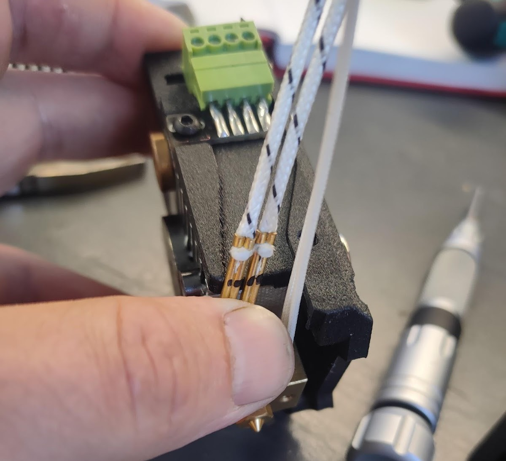

# ⚒️ Сборка модулей и юнитов

## Сборка каретки

<figure><figcaption></figcaption></figure>

#### 01. Каркас

1. Запрессовываем резьбовые заклепки.

<figure><figcaption></figcaption></figure>

<figure><figcaption></figcaption></figure>

2. Нарезаем резьбу М2.5:

<figure><figcaption></figcaption></figure>

3. Нарезаем резьбу М3:

<figure><figcaption></figcaption></figure>

4. Зенкуем отверстия под М2.5 потай:

<figure><figcaption></figcaption></figure>

5. Собираем каркас согласно картинкам ниже:

* боковины сверху М2.5х6 DIN912
* боковины снизу М2.5х8 потай
* Рельса MGN9-40mm - М3х10 DIN912, гайка самоконтр. (есть печатный кондуктор для ровной установки рельсы, ищите в коробке со всем дуаловским барахлом)
* стойки 20мм - М3х8 ISO 7380 + фиксатор резьбы
* деталь крепления рельсы (серединка) ставится более толстыми плечами вверх


Если детали каркаса крашеные, то необходимо в месте, где кайка рельсы касается каркаса, зачистить краску, иначе автоуровень может работать некорректно!


<figure><figcaption></figcaption></figure>

<figure><figcaption></figcaption></figure>

#### 02. Держатель печатных голов

<figure><figcaption></figcaption></figure>

1. Зенковка М3 (для педантов Ø6.8).
2. Резьба М3. В резьбу сверху закручиваем М3х6 din 912 (на рисунке не показано).


Если резьба под магнитом сорвется - можно запрессовать латунную гайку.


3. Запрессовываем пиптыки.


Если отверстий нет - сверлим сверлом Ø1.9мм на расстоянии 22мм друг от друга симметрично относительно центра. Пиптыки кладем шляпкой на стол и молотком заминаем его ножку. После чего&#x20;


3. Запрессовываем подпружиненные шарики.


Если шарики выпадают, то садим на суперклей.


5. Запрессовываем рога.


Если болтаются, можно аккуратно въе..ать сзади керном по линии прилегания вала и алюминия.

Если не лезут совсем, можно развернуть отверстия разверткой 6мм на ⅘ длины, а в оставшиеся \~5мм допрессовать.


#### Подготовка магнита:

<figure><figcaption></figcaption></figure>

1. Зенковка М3 (для педантов Ø6.8)
2. Делаем кастомный винт М3 потай 13.5-14мм (главное чтобы при закрученном магните не торчал за плоскость держателя печатных голов)
3. Провода (90мм) обжимаем в XH2.54 2pin, полярность не важна.

#### 03. Подготовка печатных плат 

В плате коммутации нагреваем феном и выпаиваем разъем хотэнда (или не запаиваем изначально, если паяем самостоятельно). На его место с внутренней стороны к контактным площадкам нагревателя планарно припаиваем угловой XH2.54. Должно получиться так:

 

В плате автоуровня вместо разъема припаиваем провода от двигателей экструдера или от вентиляторов длиной 5 см и обжимаем в XH2.54:

<figure><figcaption></figcaption></figure>

#### 04. Сборка каретки

<figure><figcaption></figcaption></figure>

1. Одеваем каретку MGN9H на рельсу, затем через печатную проставку крепим плату автоуровня - М3х10 ISO 7380

<figure><figcaption></figcaption></figure>

2. Крепим держатель ПГ - М3х6 iso 7991 - 4шт и магнит - М3х13.5 iso 7991 (кастомный)


При установке магнита необходимо смазать термопастой место соприкосновения магнита и алюминиевой детали!


<figure><figcaption></figcaption></figure>

<figure><figcaption></figcaption></figure>

3. Устанавливаем пружинку Ø7\*0.6\*14мм (та же, что используется на парковке).
4. Вставляем разъемы с внутренней стороны платы (автоуровень в автоуровень и магнит в припаяный на место хотэнда угловой XH2.54), крепим плату на 4 винта М3х6 ISO 7380

&#x20;&#x20;

<figure><figcaption></figcaption></figure>

5. Ставим вентиляторы обдува (провода сначала надо обрезать и обжать - 5 см) - М3х18 ISO 7380 - 4шт. (для винтов, которые ближе к пружине нужно поставить шайбы М3, чтобы винты не упирались в держатель)

* сам печатный обдув - М2.5х8 ISO 7380 - 2шт.

## Сборка печатной головы


[ссылка на 3д-моде](https://drive.google.com/file/d/1tqiw7Klzf4yO5_oGO0vzYZ5wwTToEhN7/view?usp=share_link)ль


#### 01. Радиатор

1. Запрессовываем втулки (после запрессовки необходимо рассверлить втулки сверлом 6,1 мм и проверяем его на держателе головы).
2. Нарезаем резьбу М3. Помимо того, что показано еще 2 спереди (крепление вентилятора), 1 сбоку (под винт-фиксатор хотэнда) и 1 сзади под крепление блина.
3. Зенковка М3 (для педантов Ø6.8), так чтобы потайной винт был ниже уровня блина.
4. Сначала проходим сверлом Ø2.5, потом нарезаем резьбу М3, затем аккуратно в несколько заходов зенкуем зенкером Ø6.8 до диаметра 3.8-4.0мм. Нужно понимать, что здесь мы не зенкуем коническое отверстие под винт потай, а формируем кромку прилегания для подпружиненного шарика диаметром около 5мм и если перестараться, шарик будет утопать в вашей зенковке не подпружинивая, и голова будет плохо центроваться на каретке.&#x20;
5. Блин слегка шлифуем мелкой наждачкой и крепим винтом М3х6 ISO 7991.

<figure><figcaption></figcaption></figure>

#### 02. Печатное основание

Помимо удаления поддержек и всяких дефектов-артефактов:

1. Запрессовываем гайки М3.
2. Запрессовываем хитрые латунные гайки М3 (как в экструдере).
3. Проходимся разверткой 7мм.
4. Запрессовываем цилиндрические магниты 5х5 мм (правильной стороной, чтобы работали датчики Холла!!!!)


Берем эталонный датчик холла и проверяем стороны магнита.


<figure><figcaption></figcaption></figure>

<figure><figcaption></figcaption></figure>

#### 03. Вентилятор радиатора&#x20;

Длина проводов вентилятора - 55 мм (обжимаем в xh2.54-2pin w-to-w МАМА).

Вставляем аккуратно его в печатную деталь и прокладываем его провода как на фото.


Если разъем не очень плотно держится в печатной детали, можно капнуть чуть-чуть суперклея, но без фанатизма.


<figure><figcaption></figcaption></figure>

<figure><figcaption></figcaption></figure>

Рассверливаем отвертия в вентиляторе (веделены красным) сверлом 4 мм, после чего впаиваем туда латунные гайки

<figure><figcaption></figcaption></figure>

#### 03. Бутерброд

Собираем бутерброд из печатной детали, вентилятора и радиатора.&#x20;

Сверху - М3х10 ISO 7380

Спереди через магниты 12 мм с зенковкой:

* верхние - М3х20 ISO 7991
* нижние - М3х16 ISO 7991.

<figure><figcaption></figcaption></figure>

#### 04. Слюда

Сочиняем слюдяное пикассо.&#x20;

Слюда нужна в качестве изоляции между горячей частью снизу и холодной сверху, в радиаторе. В стандартной голове эту функцию по совместительству выполняет плата автоуровня, а здесь не выполняет. Слюду принято фрезеровать на фрезере и клеить к низу радиатора на тонкий слой высокотемпературного серого герметика. Технология фрезеровки слюды является тайным знанием и передается опытными джедаями юным подаванам из уст в уста.  Должно получиться примерно так:

<figure><figcaption></figcaption></figure>

#### 05. Хотенд

Из старой платы тензодатчика дремелем или болгаркой и сверлом 3мм колхозим плату хотэнда, припаиваем к ней [Клеммник разъемный KSE-15EDGVC-3.50-04P:](https://belchip.by/product/?selected_product=51366)


Размер платы 8х21 мм


<figure><figcaption></figcaption></figure>

Собираем хотэнд по классической методике, провода не пока не обрезаем. Оголяем провода нагревателя, вставляем хотэнд в радиатор (термобарьер должен выступать из радиатора на 1,5-2 мм), фиксируем термобарьер в радиаторе (М3х25 DIN912), временно устанавливаем плату хотэнда без крышки (М3х6 ISO 7380).&#x20;

<figure><figcaption></figcaption></figure>


Далее идет достаточно спорная операция с загибанием жесткой части проводов нагревателя. Временная мера, впоследствии от нее избавимся, но пока так.


Загибаем так, чтобы провода легли в паз печатной детали.

<figure><figcaption></figcaption></figure>

Провода нагревателя и PT1000 обрезаем, припаиваем к плате по месту. На провода нагревателя надеваем оплетку длиной 50 мм. Одеваем боковые крышки, фиксируем (M3x10 ISO 7380).

<figure><figcaption></figcaption></figure>

## Сборка экструдера


Экструдер собираем в конфигурации тулченджера.


* с кастомной передней деталькой (на картинке выделена синим), крепим на М3х25 ISO 7380;
* c доп. деталькой крепления косы ПГ (на картинке выделена синим);
* длина шлейфа двигателя - 80мм;&#x20;
* длина трубки экструдера - 77 мм.

<figure><figcaption></figcaption></figure>

Распиновка двигателя:

<figure><figcaption></figcaption></figure>

## Сборка парковочных мест

#### 01. Подготавливаем металлическую детальку:

1. Нарезаем резъбу M3 (иногда нужно заранее рассверлить отверстие сверлом 2.5 мм).
2. Рассверливаем отверстия сверлом 4.5 мм.
3. Шлифуем плоскость детальки с обеих сторон.

<figure><figcaption></figcaption></figure>

#### 02. Собираем держалку головы:

   

1. Резьба М3
2. Резьба М2.5
3. М2.5x6 DIN 912
4. М3х30 ISO 7380
5. ~~М3х6 ISO 7991 и магнитики 12х2,5мм с зенковкой.~~ <mark style="color:red;">**Теперь не ставим!!!**</mark>
6. М3х8 ISO 7380

#### 03. Подготавливаем микроюнит датчика холла


**ВНИМАНИЕ!**

<mark style="color:red;">**ЕСЛИ ДАТЧИКИ ИЗ ПАРТИИ С ОЗОНА (3144 121Y) - ПЕРЕПАИВАЕМ САМ ДАТЧИК ХОЛЛА НА ПЛАТЕ НА ПРАВИЛЬНЫЙ (ЛЕЖАТ КУЧКОЙ В ОТДЕЛЬНОМ ПАКЕТИКЕ).**</mark>

Если перепаиваем дачик, то не ленимся, одеваем на ножки силиконовую изоляцию длиной 1 см от проводов кос ПГ.


&#x20;

<figure><figcaption></figcaption></figure>

1. Выпаиваем разъем Dupont и с обратной стороны припаиваем XH2.54-3pin:&#x20;

<figure><figcaption></figcaption></figure>

2. Берем из запасов стандартный шлейф от концевика Y и меняем местами: черный с красным провода со стороны платы датчика и белый  с красным провода со стороны платы управления. Должно получиться как на фото.

<figure><figcaption></figcaption></figure>

#### 04. Собираем микроюнит датчика холла:

1. Гайки М3 шестигранные - 2 шт.
2. Винт М2х8 потай - 2 шт.
3. Разъем XH2.54 3 pin - 1 шт.

<figure><figcaption></figcaption></figure>

4. Герметизируем от греха всё, что теоретически может закоротиться:

<figure><figcaption></figcaption></figure>

#### 05. Подготавливаем основание парковки

<figure><figcaption></figcaption></figure>

1. Резьбовые заклепки М3 - 4 шт.
2. Резьбовые заклепки М4 - 2 шт.
3. Хитрые точеные детальки диаметром 6мм и резьбой М4 на фиксатор резьбы.


Так как хитрые точеные детали закончились и чтобы их не токарить, то берем штыртки от кареток. На токарнике с помощью специального центровочного сверла делаем отвертие в штырьке, после чего досверливаем в нем сверлом 2,5 мм отвертие на \~15 мм и нарезаем резьбу М3.

На парковку штырьки прикручиваем винтом М3х16 ISO 7991 с лицевой стороны парковки.

.JPG>).JPG>)



Дополнительно.

Напротив боковых прорезей парковки сверлиться отверстие диаметром 5 мм.

Далее заклёпываем заклепку М3 с лицевой стороны.



#### 06. Собираем парковочное место

| <ol><li>М3х8 ISO 7380</li><li>Пружинка  0.6x6x15 (берется в коробке с тулченджерным барахлом)</li><li>Плечевой винт 4x10 М3х6 (самая маленькая шляпка). Закручиваем до упора, но без фанатизма, садим на фиксатор резьбы</li></ol> |  |
| ---------------------------------------------------------------------------------------------------------------------------------------------------------------------------------------------------------------------------------- | ---------------------------------------------------------------------------------------------------------------------------------------------------------------------------------------------- |


Есть нюанс - после сборки держалка должна свободно ходить по плечевым винтам при нажатиии и самостоятельно отпружинивать обратно при отпускании без всяких закусываний. Если этого не происходит, берем пассатижи и аккуратно подравниваем плечевые винты. Написано непонятно, так что спросите у Кузи, он шарит, как это делается))).


## Сборка кос печатных голов

#### **Пересборка кос из готовых**

Потрошим стандартную косу 1800мм для первой головы и длинную RnD косу 3000мм (обрезаем провода до 2100мм) для второй головы. На каждую голову надо 8 проводов 24AWG и по 2 провода 20AWG (таких у нас в косах нет, эти клянчим у Лифтера).&#x20;

Провода 20AWG (нагреватель хотэнда) обжимаем в черные НШВИ с обеих сторон:

<figure><figcaption></figcaption></figure>

Провода PT1000 c одной стороны белые НШВИ, с другой - xh2.54-2pin:

<figure><figcaption></figcaption></figure>

Провода вентилятора - xh2.54-2pin - xh2.54-2pin ЗЕРКАЛЬНО:

<figure><figcaption></figcaption></figure>

Провода двигателя экструдера xh2.54-4pin -  xh2.54-4pin wire-to-wire:

<figure><figcaption></figcaption></figure>

НШВИ с одной из сторон вставляем в разъем 15EDGK-3.5-04P-14-00AH:

<figure><figcaption></figcaption></figure>

Одеваем пластиковую оплетку-самозаворачивалку 4мм длиной 100-110мм на провода вентилятора (xh2.54 c обеих сторон) и тканую оплетку-самозаворачивалку диаметром 10мм и длиной 1400мм на всю косу. С обратной стороны стяжку, чтобы оплетка не елозила туда-сюда. Должно получиться примерно так:

<figure><figcaption></figcaption></figure>

Одеваем поверх оплетки печатную детальку - держатель косы (она из гибкого материала, можно её раздвинуть пальчиками или плоскогубцами, например):

<figure><figcaption></figcaption></figure>

Вставляем всё в свои разъемы, укладываем, как показано на картинках, прикручиваем печатную детальку к экструдеру, фиксируем разъем экструдера стяжкой:

    

#### Сборка кос с нуля

Провода 20AWG (нагреватель хотэнда) обжимаем в черные НШВИ с обеих сторон:


Длина:

для левой косы - 1800 мм

для правой косы - 2100 мм


<figure><figcaption></figcaption></figure>

Провода 24AWG PT1000 c одной стороны белые НШВИ, с другой - xh2.54-2pin:


Длина:

для левой косы - 1800 мм

для правой косы - 2100 мм


<figure><figcaption></figcaption></figure>

Провода вентилятора - xh2.54-2pin - xh2.54-2pin ЗЕРКАЛЬНО:


Длина:

для левой косы - 1800 мм

для правой косы - 2100 мм


<figure><figcaption></figcaption></figure>

Провода двигателя экструдера xh2.54-4pin - xh2.54-4pin wire-to-wire:


Длина:

для левой косы - 1800 мм

для правой косы - 2100 мм


<figure><figcaption></figcaption></figure>

НШВИ нагревателя и термистора с одной из сторон вставляем в разъем 15EDGK-3.5-04P-14-00AH:


Слева - термистор

Справа - нагреватель


<figure><figcaption></figcaption></figure>

Одеваем пластиковую оплетку-самозаворачивалку 4мм длиной 100-110мм на провода вентилятора (xh2.54 c обеих сторон) и тканую оплетку-самозаворачивалку диаметром 10мм и длиной 1400мм на всю косу. С обратной стороны фиксируем стяжкой. Должно получиться примерно так:

<figure><figcaption></figcaption></figure>

Одеваем поверх оплетки печатную детальку-держатель косы (она из гибкого материала, можно её раздвинуть пальчиками или плоскогубцами, например):

<figure><figcaption></figcaption></figure>

Вставляем всё в свои разъемы, укладываем, как показано на картинках, прикручиваем печатную детальку к экструдеру **(М3х25 ISO 7380)**, фиксируем разъем экструдера стяжкой:

&#x20;  &#x20;

<figure><figcaption></figcaption></figure>

<figure><figcaption></figcaption></figure>

## Сборка дополнительного держателя катушки

#### Подготавливаем печатную деталь.

#### Обрезаем резьбовую шпильку М8 длиной 110 мм

#### Запрессовываем 2 квадратные гайки М3.

#### Собираем дополнительный держатель:

* берем 2 гайки М8, 3 подшипника 608ZZ, резьбовую шпильку
* устанавливаем гайку М8 на штатное место
* в штатные прорези устанавливаем подшипники
* закручиваем шпильку в первую гайку, не забываем про подшипники
* продев шпильку через все подшипники
* устанавливаем вторую гайку М8
* садим резьбу на фиксатор резьбы
* закручиваем шпильку во вторую гайку М8

## Установка собранных модулей и юнитов / Изменения в сборке модулей и юнитов

#### 01. Корпус

Заклёпываем резьбовые заклепки М3 крепления парковочных мест.

<figure><figcaption></figcaption></figure>

**НЕзаклепываем** резьбовые заклепки М3 крепления накладки задней стенки.

<figure><figcaption></figcaption></figure>

Рассверливаем отверстия крепления 2-го датчика филамента сверлом 5мм и заклёпываем резьбовые заклепки М3 **СНАРУЖИ**

<figure><figcaption></figcaption></figure>

#### 02. Кинематика

* меняем лапку концевика X на специальную для DUAL
* лапку концевика Y переставляем назад
* слегонца болгарим портал слева, чтобы первая голова становилась на парковку

#### 03. Электронный блок

* меняем/устанавливаем БП в эл.блоке на 200W

#### 04. Стол



Меняем/устанавливаем алюминиевое основание стола на специальное с выборками под парковочные места.

Красиво болгарим переднюю декоративную накладку под всё те же клапана парковочных мест



Кладем специальное стекло для Dual с вырезами под парковки.



#### 05. Экструдер

Смотреть пункт [**Сборка экструдера**](sborka-modulei-i-yunitov.md#sborka-ekstrudera)**.**

#### 06. Печатная голова

Смотреть пункт [**Сборка Печатной головы**](sborka-modulei-i-yunitov.md#sborka-pechatnoi-golovy-ssylka-na-3d-model)**.**

#### 07. Сборка.

Юнит задней стенки (ЮЗС) собираем в конфигурации DUAL с доп. трубкой-каналом справа

Ставим дополнительный датчик филамента c фитингом, проводим его шлейф через ЮЗС в правый тоннель.

Концевик Y перемещаем/устанавливаем сзади. Мелкую детальку-фиксатор проводов можно слегка чикнуть ножичком, чтобы 3х-проводной шлейф концевика в неё хорошо ложился

<figure><figcaption>
Фиксатор проводов концевика Y
</figcaption></figure>

<figure><figcaption>
Концевик Y после модификации
</figcaption></figure>

Лапку концевика Y подгибаем вверх, чтобы попадали в щель

Берем со столовой полки белый фиксатор проводов и фиксируем обе косы.

<figure><figcaption>
Пример фиксации косы к корпусу принтера
</figcaption></figure>

#### Устанавливаем парковки:

* ослабляем крепление полки передней панели
* парковочные места наживляем в боковинах (так, чтобы винты скользили в прорезях вверх-вниз, но люфт был минимальным) и хорошо прикручиваем к полке
* ставим обе ПГ на парковочные места и двигая вверх-вниз полку “в сборе” с парковочными местами, добиваемся того, чтобы каретка своими рогами заходила в обе ПГ как можно ровнее. Фиксируем переднюю полку.&#x20;
* далее, если каретка заходит в ПГ под углом, нажимаем на торчащий угол парковке, ловим оптимальное положение и фиксируем боковые винты парковки
* проводим в подвал шлейфы датчиков парковки, фиксируя их в детальках-фиксаторах проводов концевика, термистора и камеры.

#### Собираем держатель кос:

* алюминиевая трубка диаметром 6мм, длинной 450мм.
* 3 магнита 12 мм с фаской + М3х8 потай.
* гайку и винт М3x18 ISO 7380 для фиксации алюминиевой трубки.

<figure><figcaption></figcaption></figure>

#### Режем/вставлям тефлоновые трубки:

* 750 мм - левая.
* 600 мм - правая.

Берем спиральную оплетку 6 мм длиной 350мм и заворачиваем вместе трубку и косу печатной головы.

<figure><figcaption>
Пример завернутой косы и трубки в оплетку
</figcaption></figure>

Заднюю стальную крышку крепим на винты М3х6 потай (шляпкой изнутри принтера) и колпачковые гайки снаружи.

Устанавливаем дополнительный держатель катушки.

Проводим все провода через тоннели в подвал, переходим к подключению.

## Подключение

[Подключение косы первой головы](https://www.figma.com/file/X9WwrNKUQqPAKn4cN9oWFJ/Toolchanger-tool0-connection?node-id=0%3A1\&t=2gI6XJn3zCmCmekO-1)

[Подключение косы второй головы](https://www.figma.com/file/GLTka7ZgJhVgqIfHdw7OtF/Toolchanger-tool1-connection?node-id=0%3A1\&t=6xhSHEfXzlOoGdZv-1)

[Подключение остального](https://www.figma.com/file/Zv0JVWCCv5MX4IfRR4hBOG/Toolchanger-other-connections?node-id=0%3A1\&t=LzTC5Ch2ivboOUdk-1)

[Запуск и настройка ](https://docs.google.com/document/d/1JqfKQ9mLFugpRIdRi6iEIp5E9hRSLpBilKQ2wFxqMMo/edit?usp=sharing)
