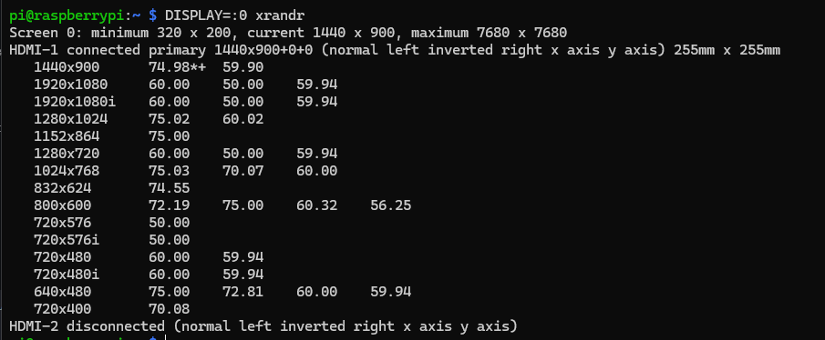
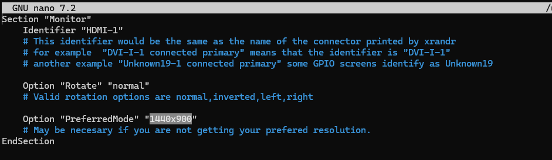

# Настройки дисплея HDMI

<figure><figcaption></figcaption></figure>

## Переворачиваем изображение

Подключаемся по SSH.

Открываем файл командой:

```bash
sudo nano /usr/share/X11/xorg.conf.d/90-monitor.conf
```

Вставляем в него следующее содержимое (при необходимости  меняем):


```bash
Section "Monitor"
    Identifier "HDMI-1"
    # This identifier would be the same as the name of the connector printed by xrandr
    # for example  "DVI-I-1 connected primary" means that the identifier is "DVI-I-1"
    # another example "Unknown19-1 connected primary" some GPIO screens identify as Unknown19

    Option "Rotate" "normal"
    # Valid rotation options are normal,inverted,left,right

    Option "PreferredMode" "1920x1080"
    # May be necesary if you are not getting your prefered resolution.
EndSection

Section "Monitor"
    Identifier "HDMI-2"
    # This identifier would be the same as the name of the connector printed by xrandr
    # for example  "DVI-I-1 connected primary" means that the identifier is "DVI-I-1"
    # another example "Unknown19-1 connected primary" some GPIO screens identify as Unknown19

    Option "Rotate" "normal"
    # Valid rotation options are normal,inverted,left,right

    Option "PreferredMode" "1920x1080"
    # May be necesary if you are not getting your prefered resolution.
EndSection
```


<figure><figcaption><p>Пример настройки для нормального отображение дисплея</p></figcaption></figure>

<figure><figcaption><p>Пример настройки для перевернутого отображение дисплея</p></figcaption></figure>

Сохраняем и выходим: **Ctrl+S, Ctrl+X**

## Настройка разрешения экрана

Получаем список доступных разрешений для дисплея командой:

```
DISPLAY=:0 xrandr
```

Получаем такой список:

<figure><figcaption></figcaption></figure>

Далее выбираем из него подходящее разрешение, например 1440x900.

Открываем файл:

```bash
sudo nano /usr/share/X11/xorg.conf.d/90-monitor.conf
```

В строчке Option "PreferredMode" вводим значение разрешения экрана:

<figure><figcaption></figcaption></figure>

Сохраняем и выходим: **Ctrl+S, Ctrl+X**


## Переворачиваем тачскрин

Открываем файл настройки тачскрина командой:

```bash
sudo nano /usr/share/X11/xorg.conf.d/40-libinput.conf
```

Листаем вниз и находим секцию **"InputClass" Identifier "libinput touchscreen catchall"**

<figure><figcaption></figcaption></figure>

Далее в эту секцию необходимо добавить строчку (тут пример для переворота на 180 градусов):

```bash
Option "TransformationMatrix" "-1 0 1 0 -1 1 0 0 1"
```


**Ознакомиться с возможными параметрами для переворота тачскрина можно тут:**

[**ссылка**](https://klipperscreen.readthedocs.io/en/latest/Troubleshooting/Touch_issues/#touch-rotation-and-matrix)


<figure><figcaption></figcaption></figure>

Сохраняем и выходим: **Ctrl+S, Ctrl+X**


**После внесения всех изменений перезагружаемся командой:**

```bash
sudo reboot
```
