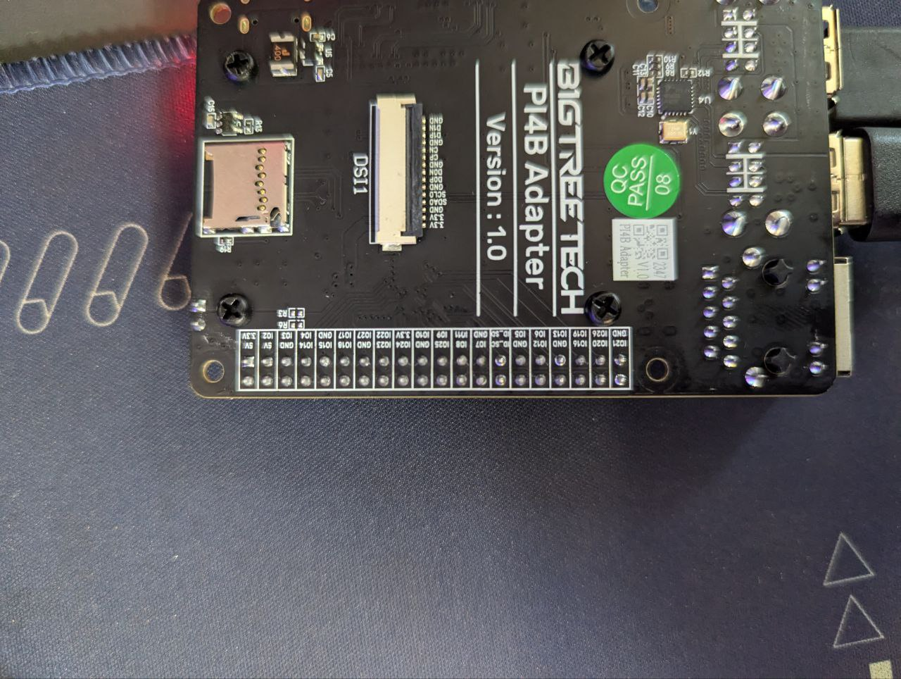

# Работа с GPIO



Для RPI CM4 стандартным средством управления GPIO является утилита raspi-gpio

Ниже приведена справочная страничка данной утилиты:

<figure><figcaption></figcaption></figure>

Распиновка GPIO для RPI CM4 и BTT PI4B Adapter v1.0:

<figure><figcaption></figcaption></figure>

Изучаем справочную страничку, после чего составляем команду:

```
raspi-gpio set 26 op pu dh
```

где:

* raspi-gpio - вызов утилиты управления GPIO (также можно использовать pinctrl, так как не требует повышенных привилегий для выполнения)
* set 26 - выбор пина (на плате подписан, как IO26)
* op - установить выбранный пин в состояние output
* pu - подтянуть выбраный выход к +
* dh - перевести выход в состояние 1 (dl - переведет в состояние 0)&#x20;

