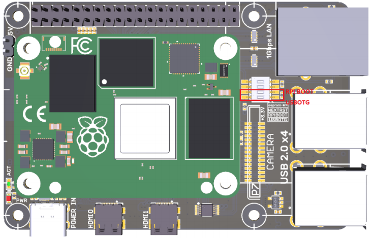

# Снятие образа с RPICM4


**ВНИМАНИЕ! ВСЕ ДЕЙСТВИЯ ПРОВОДЯТСЯ В ОПЕРАЦИОННОЙ СИСТЕМЕ LINUX!**


1. Скачиваем и устаналиваем rpiboot:

* для Mac и Linux:



2. Переводим переключатели на борде (3 и 4) в верхнее положение:

<figure><figcaption></figcaption></figure>

3. Подключаем CP к компьютеру, включаем rpiboot командой **sudo ./rpiboot** и ждем окончания прошивки.
4. После окончания прошивки проверяем, определилось ли хранилище в системе командой:

```bash
lsblk
```

Должно быть устройство с общим объемом 32Гб.

5. Вводим в терминал команду (sdb заменить на полученное выше название):

```bash
sudo dd if=/dev/sdb of=image_rpicm4_26082024.img bs=8m status=progress
```

После снятия образа отключаем устройство, переводим переключатели в нижнее положение, после чего включаем и проверяем работу.
