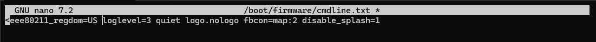
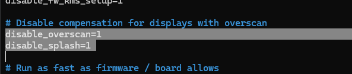

# UI Debian 12

## Отключение консоли при запуске RPI CM4:

* Открываем файл конфигурации:

```bash
sudo nano /boot/firmware/cmdline.txt
```

* Меняем "console=Пtty0" на "console=tty3"

<figure><figcaption></figcaption></figure>

* В самый конец добавляем:

```bash
loglevel=3 quiet logo.nologo fbcon=map:2 disable_splash=1
```

<figure><figcaption></figcaption></figure>

Сохраняем и выходим: Ctrl+S, Ctrl+X

## Отключаем гардиентный квадрат при загрузке:

```bash
sudo nano /boot/firmware/config.txt
```

Находим строчку "disable\_overscan=1" и добавляем сразу под ней строчку "disable\_splash=1"

<figure><figcaption></figcaption></figure>

Сохраняем и выходим: Ctrl+S, Ctrl+X


<mark style="color:red;">**Полезные ссылки:**</mark>

[ttps://forums.raspberrypi.com/viewtopic.php?t=252163](https://forums.raspberrypi.com/viewtopic.php?t=252163)

[https://raspberrypi.stackexchange.com/questions/117098/how-to-remove-the-bootloader-startup-screen-on-rpi-4-buster](https://raspberrypi.stackexchange.com/questions/117098/how-to-remove-the-bootloader-startup-screen-on-rpi-4-buster)

[https://www.hackster.io/RandomRoboSmith/changing-the-splash-screen-on-your-raspberry-pi-7aee31](https://www.hackster.io/RandomRoboSmith/changing-the-splash-screen-on-your-raspberry-pi-7aee31)
