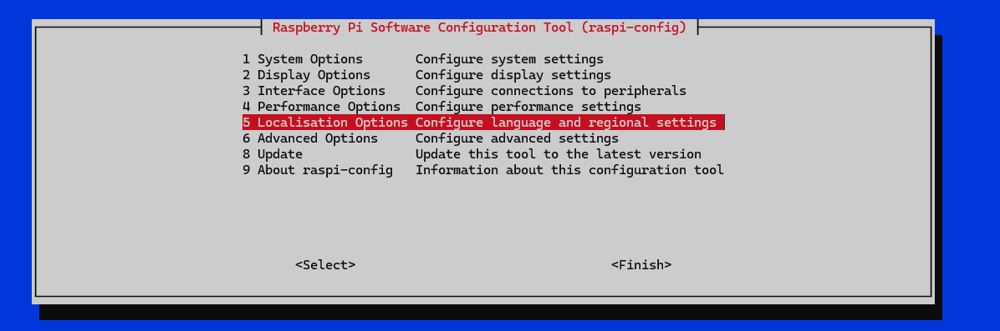
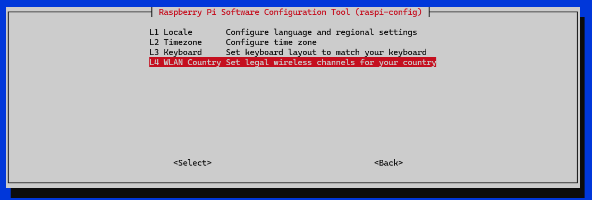
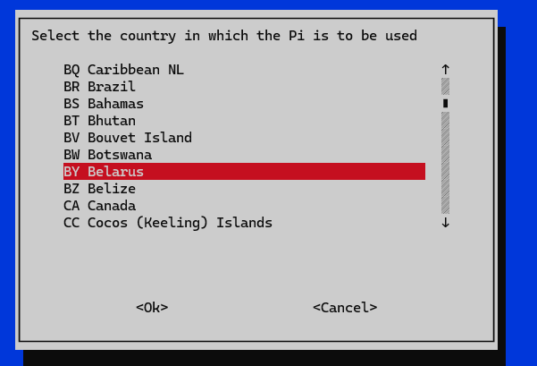

# Установка ПО

## 00. Подготовка

После прошивки eMMC и перевода переключателей в положение "Off" подаем питание и ожидаем запуска.

После запуска через веб-интерфейс роутера находим IP-адрес RPI4 и подключаемся к нему по SSH.


Логин: pi

Пароль: raspberry


После подключение удаляем ненужные папки в домашней директории (при их наличии):&#x20;

<pre class="language-bash"><code class="lang-bash"><strong>sudo rm -rf ~/Desktop
</strong>sudo rm -rf ~/Documents
sudo rm -rf ~/Downloads
sudo rm -rf ~/Videos
sudo rm -rf ~/Music
sudo rm -rf ~/Templates
sudo rm -rf ~/Public
sudo rm -rf ~/Pictures
sudo rm -rf ~/Bookshelf
</code></pre>

Далее запускаем обновление системы:

```bash
sudo apt-get update -y && sudo apt-get upgrade -y && sudo apt-get install git wget
```

Если не было настроено при прошивке, то устанавливаем страну WIFI:

```bash
sudo raspi-config
```

Выбираем 5 Localisation Option&#x20;

<figure><figcaption></figcaption></figure>

L4 WLAN Country

<figure><figcaption></figcaption></figure>

Выбираем страну по коду (BY, RU)

<figure><figcaption></figcaption></figure>

Cancel -> Finish

```bash
sudo reboot
```

Данная манипуляция нужна для того, чтобы wifi не отваливался.


## 01. Установка ПО

Скачиваем и устанавливаем Kiauh для установки остального ПО:

```bash
cd ~
git clone https://github.com/Z-Bolt/kiauh-zb -b Z-BoltUI3
cd ~/kiauh-zb
./kiauh.sh
```

Далее устанавливаем необходимое ПО:

### Klipper

1\) \[Install] -> 1) \[Klipper] -> 1) \[Python 3.x] -> 1 -> Y ->


### Moonraker

1\) \[Install] -> 2) \[Moonraker] -> Y


### Fluidd

1\) \[Install] -> 4) \[Fluidd] -> Y


### KlipperScreen

1\) \[Install] -> 5) \[KlipperScreen] ->&#x20;


### Crowsnest

1\) \[Install] -> 13) \[Crowsnest] -> Y -> N


### Устанавливаем программу для автомонтирования USB-накопителей

```bash
cd ~
git clone https://github.com/Z-Bolt/pub_automount -b RPI4B
cd ~/pub_automount
sudo sh automount
```

### Настройка внешней антенны&#x20;

```bash
sudo nano /boot/firmware/config.txt
```

Листаем в самый них и добавляем строчку

```bash
dtparam=ant2
```

Должно получиться так:

<figure><figcaption></figcaption></figure>

Сохраняем и выходим: Ctrl+S, Ctrl+X
