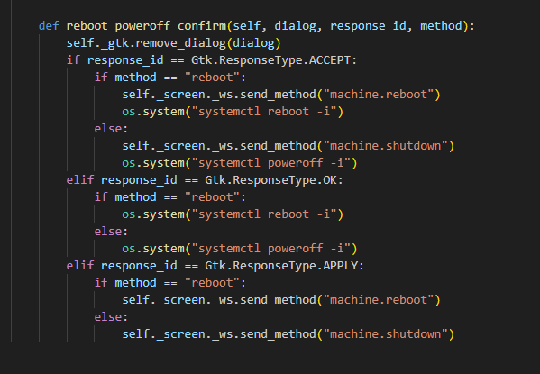
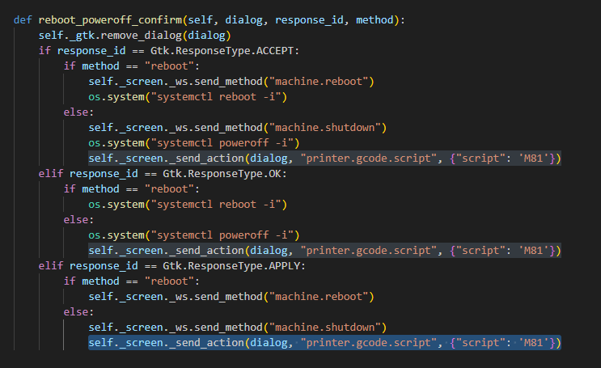
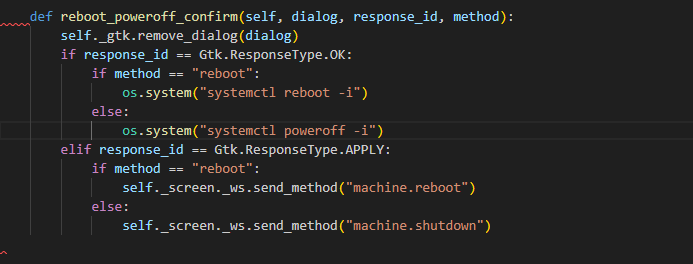

# Выключение системы для старых принтеров на RPI CM4

<pre class="language-bash"><code class="lang-bash"><strong>sudo nano ~/KlipperScreen/panels/shutdown.py
</strong></code></pre>

Листаем в самый низ и находим функцию def reboot\_poweroff\_confirm:

<figure><figcaption></figcaption></figure>

Добавляем следующую строчку в указанные на фото ниже места:

```python
self._screen._send_action(dialog, "printer.gcode.script", {"script": 'M81'})
```

<figure><figcaption></figcaption></figure>

Комментируем следующие строчки:

<figure><figcaption></figcaption></figure>

```bash
sudo nano ~/KlipperScreen/panels/splash_screen.py
```

Листаем в самый низ и находим функцию def reboot\_poweroff\_confirm:

<figure><figcaption></figcaption></figure>

Добавляем строчки и комментируем:

<figure><figcaption></figcaption></figure>

