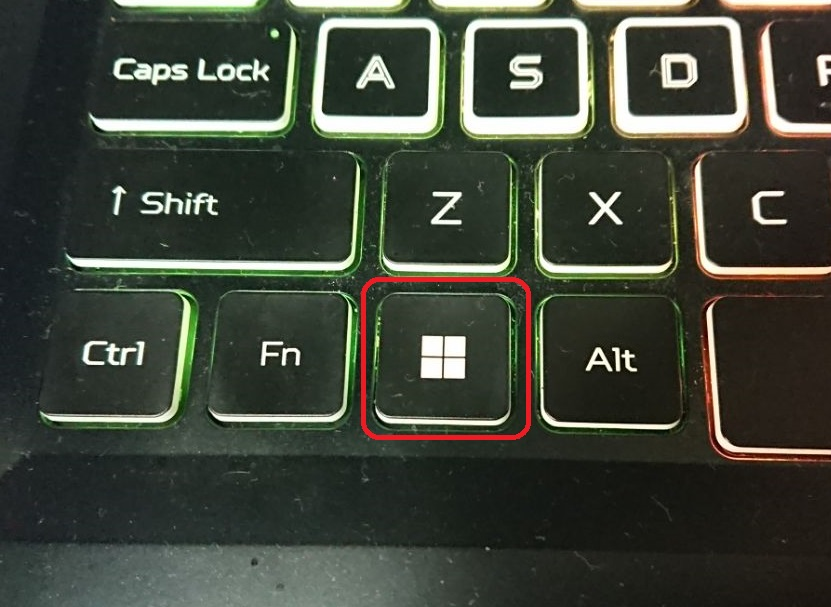
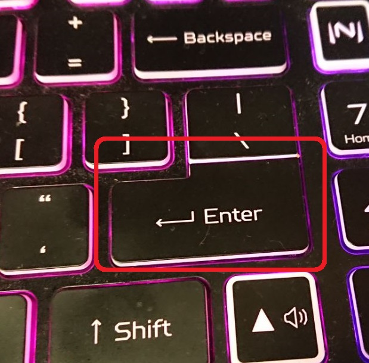

# Подключение по SSH

## Средствами Windows

Нажимаем клавишу "Windows" на клавиатуре:



Вводим слово "Терминал"

<figure><figcaption></figcaption></figure>

После чего нажимаем "Enter"



В открывшемся окне вводим следующую команду (без кавычек):


Стандартные логин и пароль на принтерах с Rock Pi:

Логин: **rock**

Пароль: **rock**

Стандартные логин и пароль на принтерах с Raspberry Pi:

Логин: **pi**

Пароль: **raspberry**

Стандартные логин и пароль на принтерах с BTT CP:

Логин: **biqu**

Пароль: **biqu**



IP-адрес принтера можно узнать в панели "Сеть" принтера (в левой панели изображение "Wifi")

.jpg>)


```
ssh "логин"@"IP-адрес"
```

Далее вводим пароль.


При вводе пароля на экране **ничего не будет отображаться**, поэтому внимательно смотрим за языком при вводе и правильностью написания!


<figure><figcaption></figcaption></figure>

При правильности введенных логина и пароля в окне терминала выведеться следующее сообщение:

<figure><figcaption></figcaption></figure>

**Возможные проблемы:**

1. В случае неправильного ввода логина или пароля отобразиться следующее сообщение:

<figure><figcaption></figcaption></figure>

2. Если IP-адрес введен неправильно, то отобразиться следующее сообщение:

<figure><figcaption></figcaption></figure>

## Программой Putty

1. Скачиваем программу Putty с оффициального сайта.


Ссылка на установочник: [https://the.earth.li/\~sgtatham/putty/latest/w64/putty-64bit-0.79-installer.msi](https://the.earth.li/~sgtatham/putty/latest/w64/putty-64bit-0.79-installer.msi)


2. Устанавливаем программу.


Соглашаемся со всем, что предлагает установочник.


3. Запускаем программу. Она должна иметь вид, как на фото ниже.

<figure><figcaption><p>Putty</p></figcaption></figure>

4. В поле "Host Name (or IP address)" вводим IP-адрес принтера.


IP-адрес принтера можно узнать в панели "Сеть" принтера (в левой панели изображение "Wifi")

.jpg>)


<figure><figcaption></figcaption></figure>

5. Жмем "Open".
6. В появившемся окне вводим логин, потом пароль.


Стандартные логин и пароль на принтерах с Rock Pi:

Логин: **rock**

Пароль: **rock**



При вводе пароля на экране **ничего не будет отображаться**, поэтому внимательно смотрим за языком при вводе и правильностью написания!


<figure><figcaption></figcaption></figure>

7. При правильном выполнении предыдущих пунктов на терминал будет выглядеть так:

<figure><figcaption></figcaption></figure>

**Возможные проблемы:**

1. Если логин или пароль будут введены неверно, то  отобразиться следующее сообщение:

<figure><figcaption></figcaption></figure>

2. Если IP-адрес будет введен неправильно, то  отобразиться следующее сообщение:

<figure><figcaption></figcaption></figure>
