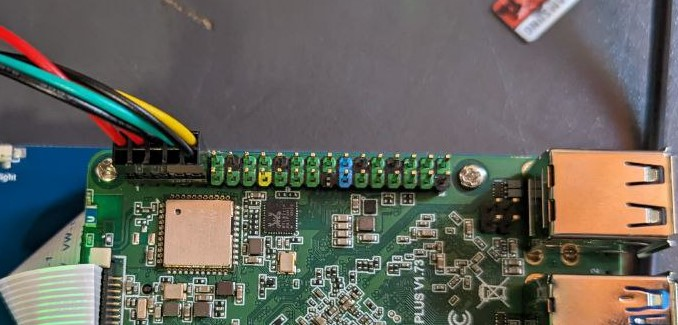
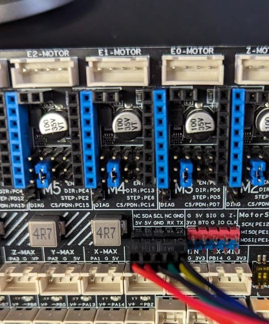

# 🕷️ Fysetc Spider V3.0 UART



{% embed url="https://github.com/FYSETC/FYSETC-SPIDER/blob/main/Spider%20Klipper%20Firmware%20Guide.pdf" %}

Компилируем Klipper для работы с UART:

```bash
cd ~/klipper
make menuconfig
```

Выставляем параметры как на фото:

<figure><figcaption></figcaption></figure>

Выходим и соглашаемся с изменениями.

Подключаем Spider по USB к Rock Pi предварительно зажав кнопку BT0.

Прошиваем Spider командой:

```
make flash FLASH_DEVICE=0483:df11
```

Ожидаем окончания прошивки.

Открываем файл настроек загрузки системы командой:

```bash
sudo nano /boot/extlinux/extlinux.conf
```

Удаляем следующее:

```
earlyprintk console=ttyFIQ0,1500000n8
```

<figure><figcaption></figcaption></figure>

Далее меняем console=ttyS2 на ttyS4, как на фото:

<figure><figcaption></figcaption></figure>

Сохраняем и выходим: Ctrl+S, Ctrl+X.


Открываем файл настройки системы командой:

```bash
sudo nano /boot/hw_intfc.conf
```

Меняем параметр **UART2** на O&#x4E;**:**

```
intfc:uart2=on
```

Должно получиться так:

<figure><figcaption></figcaption></figure>

Комментируем строчку:

```bash
intfc:dtoverlay=console-on-ttyS2
```

Должно получиться так:

<figure><figcaption></figcaption></figure>

Раскомментируем строчку:

```
intfc:dtoverlay=console-on-ttyS4
```

Должно получиться так:

<figure><figcaption></figcaption></figure>

Сохраняем и выходим: Ctrl+S, Ctrl+X.


В конфигурационном файле Klipper (printer.cfg) в секции **\[mcu]** меняем значение в строчке **serial** на      **/dev/ttyS2** и добавляем строчку **restart\_method: command**:

<figure><figcaption></figcaption></figure>

```klipper-config
serial: /dev/ttyS2
restart_method: command
```

Сохраняем и перезагружаем конфигурационный файл.

Подключаем шлейф UART:

<figure><figcaption><p>Подключение к Rock Pi</p></figcaption></figure>

<figure><figcaption><p>Подключение к Spider V3.0</p></figcaption></figure>

На Spider (проверено только для версии 2.3) нужно установить перемычку на контакты BOOT0 и GND:

<figure><figcaption></figcaption></figure>

Перезагружаем принтер и проверяем работу.
