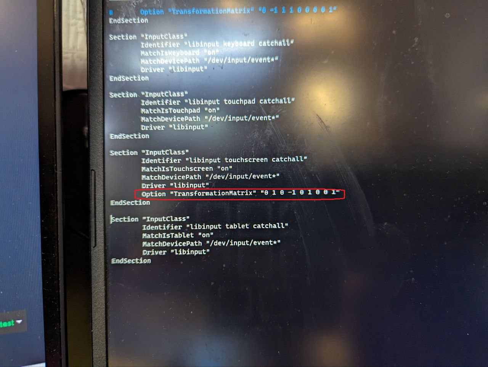

# 🖥️ Переворот экрана HDMI и DSI Rock PI

## 01. Переворот экрана для DSI дисплея

<figure><figcaption></figcaption></figure>

1. Настраиваем отображение на экране:

* открываем файл _/etc/X11/xorg.conf.d/20-modesetting.conf_:

```bash
sudo nano /etc/X11/xorg.conf.d/20-modesetting.conf
```

* добавляем в конец две секции:

```bash
Section "Screen"
    Identifier "Default Screen"
    Device     "Rockchip Graphics"
    Monitor    "Default Monitor"
EndSection

###Valid values for rotation are "normal", "left", "right"
Section "Monitor"
    Identifier "DSI-1"
    Option     "Rotate" "right"
EndSection
```

* должно получится так:

<figure><figcaption></figcaption></figure>

* Сохраняем и выходим:&#x20;

**Ctrl+S, Ctrl+X**

2. Настраиваем тачскрин:

* открываем файл _/usr/share/X11/xorg.conf.d/40-libinput.conf_:

```bash
sudo nano /usr/share/X11/xorg.conf.d/40-libinput.conf
```

* добавляем строчку в секции **Section "InputClass" Identifier "libinput touchscreen catchall":**

```bash
Option "TransformationMatrix" "0 1 0 -1 0 1 0 0 1"
```

<figure><figcaption></figcaption></figure>

* Сохраняем и выходим:&#x20;

**Ctrl+S, Ctrl+X**


Для выбора поворота тачскрина необходимо воспользоваться таблицей:

.png>)

При повороте экрана вправо (**right**) используем следующее значение (**90 Counter-Clockwise**):

**`0 1 0 -1 0 1 0 0 1`**


Перезагружаем Rock Pi и проверяем работу тачскрина.

## 02. Переворот экрана для HDMI дисплея

1. Настраиваем отображение на экране:

* открываем файл _/etc/X11/xorg.conf.d/20-modesetting.conf_:

```bash
sudo nano /etc/X11/xorg.conf.d/20-modesetting.conf
```

* добавляем в конец две секции:

```bash
Section "Screen"
    Identifier "Default Screen"
    Device     "Rockchip Graphics"
    Monitor    "Default Monitor"
EndSection
        
###Valid values for rotation are "normal", "left", "right"
Section "Monitor"
    Identifier "HDMI-1"
    Option     "Rotate" "right"
EndSection
```

2. Настраиваем тачскрин:

* создаем файл перенастройки тачскрина:

```bash
sudo nano ~/rotate_touch.sh
```

* вводим туда следующие строчки:

```bash
#!/usr/bin/bash
export DISPLAY=:0
xinput map-to-output 6 HDMI-1
```


```
map-to-output 6 - где 6 - это номер устройства тачскрина.
Посмотреть его можно командой xinput list
```

.png>)


* сохраняем и выходим:

**Ctrl+S, Ctrl+X**

* выдаем права:

```bash
sudo chmod 777 ~/rotate_touch.sh
```

* открываем файл KlipperScreen'а screen.py (в ветке Z-BOLTUI2-Q400 уже добавлено):

```bash
sudo nano ~/KlipperScreen/screen.py
```

* в нем листаем в самый низ и ставляем строчку как на фото:

```bash
os.system("/home/rock/rotate_touch.sh")
```

<figure><figcaption></figcaption></figure>

* сохраняем и выходим:

**Ctrl+S, Ctrl+X**

Перезагружаем Rock Pi и проверяем работу тачскрина.

<details>

<summary>Памятка</summary>

`xrandr` is an Xwindows utility and expects to be run inside an X session, that's where the `Cant open display` comes from.

You could do this (if your DISPLAY is :0):

```
$ export DISPLAY=:0
$ xrandr --listmonitors
$ xrandr your_command
```

.png>)

[https://www.waveshare.com/wiki/7inch\_HDMI\_LCD\_(C)](https://www.waveshare.com/wiki/7inch_HDMI_LCD_\(C\))


</details>
