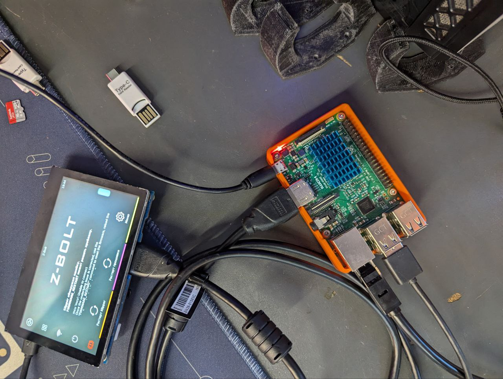

# 🖥️ Переворот экрана HDMI на Raspberry PI 3B+

## 01. Переворот экрана для HDMI дисплея

<figure><figcaption></figcaption></figure>

1. Настраиваем отображение на экране:

* открываем файл _/boot/config.txt_:

```bash
sudo nano /boot/config.txt
```

* находим эти строчки и комментируем из (символ # вначале строки):

<figure><figcaption></figcaption></figure>

* листаем в самый низ и находим строчку display\_rotate и меняем значение на 2 (по умолчанию 0):

<figure><figcaption></figcaption></figure>

* Сохраняем и выходим:&#x20;

**Ctrl+S, Ctrl+X**

2. Настраиваем тачскрин:

* открываем файл /usr/share/X11/xorg.conf.d/40-libinput.conf

<pre class="language-bash"><code class="lang-bash"><strong>sudo nano /usr/share/X11/xorg.conf.d/40-libinput.conf
</strong></code></pre>

* добавляем строчку в секции **Section "InputClass" Identifier "libinput touchscreen catchall":**

```bash
Option "TransformationMatrix" "-1 0 1 0 -1 1 0 0 1"
```

<figure><figcaption></figcaption></figure>

* Сохраняем и выходим:&#x20;

**Ctrl+S, Ctrl+X**


Для выбора поворота тачскрина необходимо воспользоваться таблицей:

.png>)

При повороте экрана нормально (**normal**) используем следующее значение (**0**):

**1 0 0 0 1 0 0 0 1**

При повороте экрана влево (**left**) используем следующее значение (**90 Clockwise**):

**0 -1 1 1 0 0 0 0 1**

При повороте экрана вправо (**right**) используем следующее значение (**90 Counter-Clockwise**):

**0 1 0 -1 0 1 0 0 1**

При повороте экрана перевернуто (**inverted**) используем следующее значение (**180 Inverts X and Y**):

**-1 0 1 0 -1 1 0 0 1**


Перезагружаем Raspberry Pi и проверяем работу тачскрина:

```bash
sudo reboot
```

<details>

<summary>Памятка</summary>

`xrandr` is an Xwindows utility and expects to be run inside an X session, that's where the `Cant open display` comes from.

You could do this (if your DISPLAY is :0):

```
$ export DISPLAY=:0
$ xrandr --listmonitors
$ xrandr your_command
```

.png>)

[https://www.waveshare.com/wiki/7inch\_HDMI\_LCD\_(C)](https://www.waveshare.com/wiki/7inch_HDMI_LCD_\(C\))


</details>
