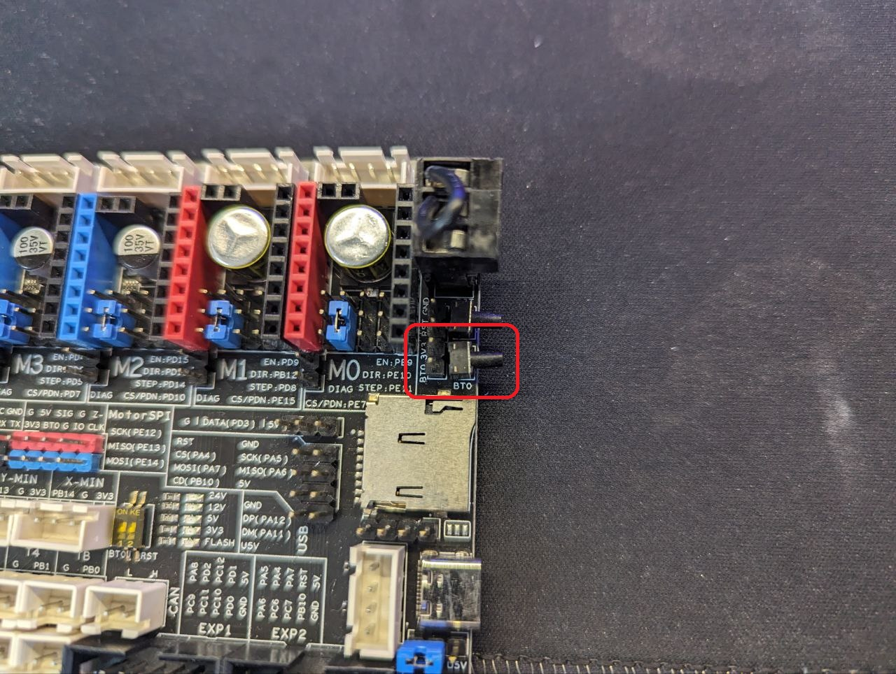

# 🕷️ Прошивка Fysect Spider

## Прошивка Spider через STM32CUBE <a href="#docs-internal-guid-7a60c3d2-7fff-0b4b-ebb5-4a26992d5f90" id="docs-internal-guid-7a60c3d2-7fff-0b4b-ebb5-4a26992d5f90"></a>

## 01. Создаем klipper.bin актуальной версии klipper:&#x20;

1. Kонектимся к одноплатнику по SSH.
2. Комплилируем прошивку:

```bash
cd ~/klipper
sudo service klipper stop
make menuconfig
```

3. Читаем git платы управления и выбираем те компоненты которые нам необходимы\
   Например:

<figure><figcaption></figcaption></figure>

4. Выходим из меню, сохраняем изменения:\
   **Q, Yes**
5. Компилируем командой:

```bash
make all
```

6. После компиляции скачиваем с одноплатника файл **klipper.bin.** Файл находится по пути: _/home/rock/klipper/out/_


Скачать можно с помощью программы [WinSCP](https://winscp.net/download/WinSCP-6.1.2-Setup.exe) или [Filezilla](https://download.filezilla-project.org/client/FileZilla_3.66.1_win64_sponsored-setup.exe).


Прошить можно и с помощью Rock Pi:

* компилируем прошивку
* включаем плату в решиме DFU
* вводим команду прошивки `make flash FLASH_DEVICE=0483:df11`

## 02. Подготовка к прошивке платы

Ставим перевычки согласно модели платы:

<details>

<summary>Fysetc Spider V2.2</summary>

Поставить перемычку 3.3v-bt0 и перемычку U5V-UVCC.


</details>

<details>

<summary>Fysetc Spider V2.3</summary>

Поставить перемычку 3.3v-bt0 и перемычку U5V-UVCC

.png>)

</details>

<details>

<summary>Fysetc Spider V3.0</summary>

**На плате V3 появилась кнопка для влючения режима прошивки.**

Перед подачей питания на принтер (или отдельно spider) зажмите эту кнопку и подайте питание.



</details>

## 03. Подключение

Подключаем плату шнуром Type-C->USB-A к ПК или ноутбуку.

## 04. Прошивка&#x20;

1. После того как плата подключена, подключаемся к ней через STM CubeProgrammer:

<figure><figcaption></figcaption></figure>

* указываем путь к **klipper.bin**
* ставим галочку **Verify programming**
* жмем **Start programming**

<figure><figcaption></figcaption></figure>

2. Ждем завершения компиляции, отключаем плату (disconnect), достаем перемычку 3.3v-bt0 и USB5v, подключаем плату назад к одноплатнику.
3. После подключения к одноплатнику командой `ls /dev/serial/by-path` узнаем порт, к которому подключена плата и изменяем его в секции \[mcu] в файле printer.cfg.

<figure><figcaption></figcaption></figure>


При успешном подключении принтера к плате управления никаких ошибок не будет.

