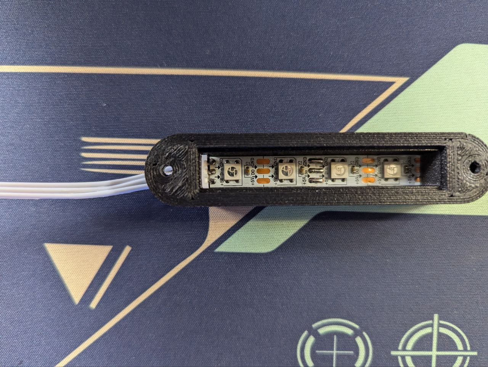

# 💡 Система оповещения состояния принтера

## 00 Подключение

Подключаем шлейф XH2,54-3pin к модулю индикатора как на фото:

<figure><figcaption></figcaption></figure>

Ответную часть шлейфа поключаем в Spider как показано на фото согласно распиновке:

<figure><figcaption></figcaption></figure>

## 01 Настройка

Подключаемся по SSH.

Переходим в  домашнюю директорию:

```bash
cd ~
```

Клонируем репозиторий:

```bash
git clone https://github.com/julianschill/klipper-led_effect
```

Останавливаем сервис klipper:

```bash
sudo systemctl stop klipper
```

Создаем символическую ссылку:

```bash
ln -s ~/klipper-led_effect/src/led_effect.py ~/klipper/klippy/extras/led_effect.py
```


Если установлено новые ПО (не Z-BoltUI2), то выполнять действие не нужно!

Создаем копию moonraker.conf:

```
sudo cp -f ~/klipper_config/moonraker.conf ~/printer_data/config/
```

Выдаем права доступа для файла:

```
sudo chmod 777 ~/printer_data/config/moonraker.conf
```


Устанавливаем klipper-led\_effect:

```bash
cd ~/klipper-led_effect
./install-led_effect.sh
```

При удачной установке перезагружаем принтер командой:

```bash
sudo reboot
```

Переходим в веб-интерфейс принтера. Далее открываем панель "Конфигурация", папка "klipper-config".

Нажимаем на кнопку со значком "+" -> "Добавить файл" -> led-effects.cfg" -> "Сохранить"

<figure><figcaption></figcaption></figure>

Открываем созданный файл и вставляем следующее содержимое:

```django
########################################
# NEOPIXEL configuration
########################################

[neopixel led_state]
pin: PD3 # пин для управления светодиодами
chain_count: 5 # кол-во светодиодов в ленте

########################################
# LED effects configuration
########################################

[led_effect state_ready]
autostart:              true
frame_rate:             60
leds:
    neopixel:led_state
layers:
    breathing 10.00 1.00 add (0.0,0.7,0.0)
    static 0.00 0.00 top (0.0,0.1,0.0)

[led_effect state_wait]
autostart:              false
frame_rate:             60
leds:
    neopixel:led_state
layers:
    breathing 5.00 1.00 add (0.7,0.7,0.0) 
    static 0.00 0.00 top (0.1,0.1,0.0) 

[led_effect progress_print]
leds:
    neopixel:led_state (5-1)
autostart:                          false
frame_rate:                         60
layers:
    progress -1 0 add (0.0, 0.0, 1.0),(0.0, 0.0, 0.5)
    static 0 0 top (0.0, 0.0, 0.01)

[led_effect progress_extruder]
leds:
    neopixel:led_state (5-1)
autostart:                          false
frame_rate:                         60
heater:                             extruder
layers:
    heatergauge 50 0 add (0.5,0.0,0.0),(1.0,0.0,0.0)
    static 0 0 add (0.01,0,0)
    
#[led_effect progress_extruder1]
#leds:
#    neopixel:led_state (5-1)
#autostart:                          false
#frame_rate:                         60
#heater:                             extruder1
#layers:
#    heatergauge 50 0 add (0.5,0.0,0.0),(1.0,0.0,0.0)
#    static 0 0 add (0.01,0,0)

[led_effect process_cooldown]
leds:
    neopixel:led_state
autostart:                          false
frame_rate:                         60
layers:
    gradient 0.2 0.5 add (0.1, 0.025, 0.0),(1.0, 0.25, 0.0),(0.1, 0.025, 0.0)

[led_effect process_end]
autostart:              false
frame_rate:             60
leds:
    neopixel:led_state
layers:
    gradient 0.2 0.5 add (0.0, 0.0, 0.01),(0.0, 0.0, 0.7),(0.0, 0.0, 0.01)

[led_effect process_leveling]
autostart:              false
frame_rate:             60
leds:
    neopixel:led_state
layers:
    gradient 0.2 0.5 add (0.01, 0.0, 0.01),(0.7, 0.0, 0.7),(0.01, 0.00, 0.01)

########################################
# GCODE Macro configuration
########################################

[gcode_macro STATE_READY]
gcode:
    STOP_LED_EFFECTS
    SET_LED_EFFECT EFFECT=state_ready

[gcode_macro STATE_WAIT]
gcode:
    STOP_LED_EFFECTS
    SET_LED_EFFECT EFFECT=state_wait

[gcode_macro PROGRESS_PRINT]
gcode:
    STOP_LED_EFFECTS
    SET_LED_EFFECT EFFECT=progress_print

[gcode_macro PROGRESS_EXTRUDER]
gcode:
    STOP_LED_EFFECTS
    SET_LED_EFFECT EFFECT=progress_extruder
    
#[gcode_macro PROGRESS_EXTRUDER1]
#gcode:
#    STOP_LED_EFFECTS
#    SET_LED_EFFECT EFFECT=progress_extruder1

[gcode_macro PROCESS_COOLDOWN]
gcode:
    STOP_LED_EFFECTS
    SET_LED_EFFECT EFFECT=process_cooldown

[gcode_macro PROCESS_END]
gcode:
    STOP_LED_EFFECTS
    SET_LED_EFFECT EFFECT=process_end

[gcode_macro PROCESS_LEVELING]
gcode:
    STOP_LED_EFFECTS
    SET_LED_EFFECT EFFECT=process_leveling
```

Сохраняем и перезагружаем.

Далее открываем файл printer.cfg и вставляем строчку:

<figure><figcaption></figcaption></figure>

```django
[include klipper-config/led-effects.cfg]
```

Сохраняем и перезагружаем.

Открываем файл klipper-config -> gcode-macros.cfg и вносим изменения в макросы согласно скриншотам:

<figure><figcaption><p>[START_PRINT]</p></figcaption></figure>

<figure><figcaption><p>[END_PRINT]</p></figcaption></figure>

<figure><figcaption><p>[COOLDOWN]</p></figcaption></figure>

<figure><figcaption><p>[RESUME]</p></figcaption></figure>

<figure><figcaption><p>[PAUSE]</p></figcaption></figure>

Сохраняем и перезагружаем.

Проверяем работу индикатора согласно разделу **02 Индикация**.

ДЛЯ КОНФИГУРАЦИИ ПРИНТЕРА DUAL

В файле **led-effects.cfg** (Веб-интерфейс -> вкладка "Конфигурация" -> klipper-config -> led-effects.cfg) необходимо раскомментировать секцию \[led\_effect progress\_extruder1]:

<figure><figcaption></figcaption></figure>

И макрос **PROGRESS\_EXTRUDER1:**

<figure><figcaption></figcaption></figure>

В файле **tools.cfg** (Веб-интерфейс -> вкладка "Конфигурация" -> klipper-config -> tools.cfg) в макросах **T0** и **T1** необходимо в начало добавить следующие строки:

В макрос T0:

```django
   

   
      PROGRESS_EXTRUDER
   

```

В макрос T1:

```django
   

   
      PROGRESS_EXTRUDER1
   

```

<figure><figcaption><p>Пример</p></figcaption></figure>

Настройка системы оповещения состояния принтера для конфигурации DUAL завершена.

## 02 Индикация

**Система оповещения состояния принтера** представляет собой модуль индикации (далее индикатор), предназначенный для оповещения оператора о состоянии принтера.

В таблице ниже представлен перечень состояний индикатора:

| **Обозначение индикатора**                                                                                                                             | <p><strong>Описание</strong><br></p>                                                   | **Состояние устройства**                                                         |
| ------------------------------------------------------------------------------------------------------------------------------------------------------ | -------------------------------------------------------------------------------------- | -------------------------------------------------------------------------------- |
|                                                                  | <p>Цвет: зеленый</p><p>Режим: дыхание<br>Макрос: STATE_READY</p>                       | Готов к работе                                                                   |
|                                                                  | <p> </p><p>Цвет: желтый</p><p>Режим: дыхание<br>Макрос: STATE_WAIT</p>                 | Ожидание                                                                         |
|                                                                  | <p> </p><p>Цвет: синий</p><p>Режим: шкала<br>Макрос: PROGRESS_PRINT</p>                | Прогресс печати (активируется макросом, работает только при активной печати)     |
| <p><br></p><p></p><p><br></p> | <p>Цвет: красный</p><p>Режим:  шкала<br>Макрос:  PROGRESS_EXTRUDER</p>                 | Прогресс нагрева (активируется макросом, работает при включении нагрева хотенда) |
| <p><br></p>                                        | <p> </p><p>Цвет: оранжевый</p><p>Режим: волна<br>Макрос: PROCESS_COOLDOWN</p>          | Отпуск детали (при активированном отпуске детали)                                |
|                                                                  | <p> </p><p>Цвет: синий</p><p>Режим: волна<br>Макрос: PROCESS_END</p>                   | Окончание печати                                                                 |
|                                                                  | <p> </p><p>Цвет: фиолетовый</p><p>Режим: волна<br>Макрос: PROCESS_LEVELING</p><p> </p> | Работа автоуровня                                                                |

