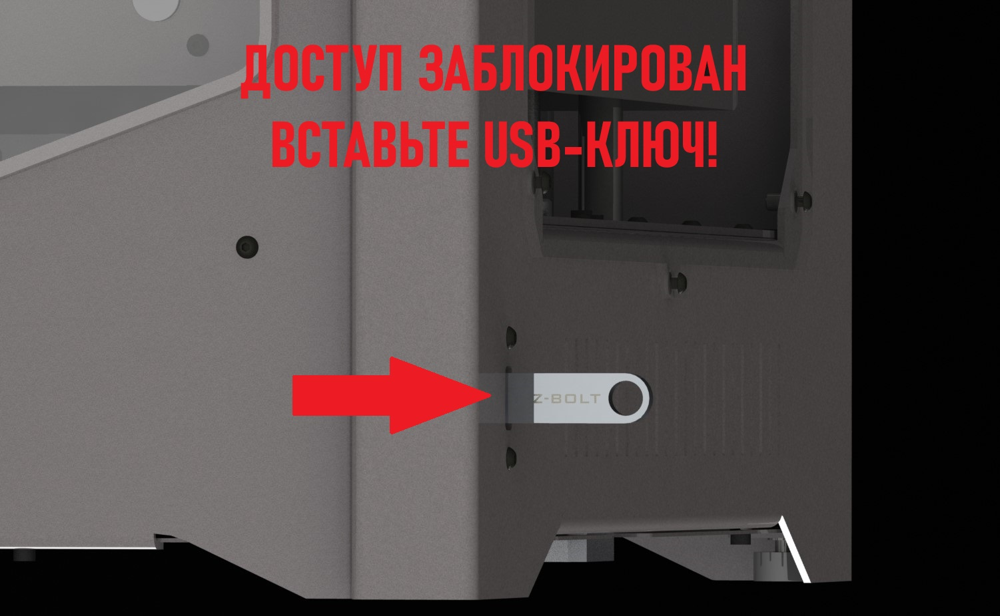

# 🔑 USB-ключ доступа v1.0 для принтеров до ZBS352576


Статья для вдохновления




Для полноценной работы программы в KlipperScreen'е необходимо в файле screen.py&#x20;

(в корневой директории **sudo nano \~/KlipperScreen/screen.py**) в самом конце добавить строчку как на фото:

```bash
os.system("sudo systemctl restart screen_lock.service")
```

<figure><figcaption></figcaption></figure>

## 01. Установка

Подключаемся по SSH.

Выполняем скачивание и установку репозитория:

```bash
cd ~
git clone https://github.com/Z-Bolt/display_blocker
cd ~/display_blocker
sudo chmod 777 ./install.sh
./install.sh
```

При завершении установки появиться сообщение:

```bash
End installing...
Reboot system!
```

Перезагружаем систему командой:

```bash
sudo reboot
```

## 02. Настройка

### Запись ключа

Настройка USB-ключа реализована через параметр VendorID (далее VID) который зашит в каждую флешку на производстве. По параметру VID система на принтере будет понимать, подходит ли ключ или нет.

Чтобы узнать VID, необходимо подключить флешку к принтеру, далее ввести команду:

```bash
lsusb
```

Вывод команды будет выглядеть примерно так:

<figure><figcaption></figcaption></figure>

Параметр VID - это первые 4 символа после ID (для данной флешки VID: 13fe):

<figure><figcaption></figcaption></figure>

Когда мы получили VID, его нужно записать в файл правила, который отвечает за понимание принтером того, подключена ли флешка или нет. Открыть файл правила можно командой:

```bash
sudo nano /etc/udev/rules.d/80-usb.rules
```

Выглядит он примерно так:

<figure><figcaption></figcaption></figure>

Нас интересует значение параметра idVendor (в примере указано "346d" - данный VendorID соответствует комплектным флешкам Z-Bolt):

<figure><figcaption></figcaption></figure>

Изменим значение параметра на полученное выше (346d), сохраним и выйдем (Ctrl+S, Ctrl+X) , далее перезагрузим принтер командой:

```bash
sudo reboot
```

После перезагрузки при отключении флешки экран будет блокироваться.

### Настройка изображения экрана блокировки

В директории репозитория есть изображение lock.JPG.

<figure><figcaption></figcaption></figure>

Разрешение изображения 800x480 (если больше или меньше, то будет искажение изображение).

Заменяем его на другое и при блокировке изображение будет новым.
