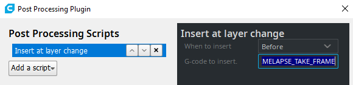

# 🎥 Timelapse


[https://github.com/mainsail-crew/moonraker-timelapse/blob/main/docs/installation.md](https://github.com/mainsail-crew/moonraker-timelapse/blob/main/docs/installation.md)


## 01. Настройка

Подключаемся к принтеру по SSH.

Устанавливаем moonraker-timlapse и копируем конфиг:

```bash
cd ~/
git clone https://github.com/mainsail-crew/moonraker-timelapse.git
cd ~/moonraker-timelapse
make install
sudo cp ~/printer_data/config/timelapse.cfg ~/klipper_config/klipper-config/
```

Далее открываем файл moonraker.conf и в конец вставляем следующее:

```django
[update_manager timelapse]
type: git_repo
primary_branch: main
path: ~/moonraker-timelapse
origin: https://github.com/mainsail-crew/moonraker-timelapse.git
managed_services: klipper moonraker
```

Открываем printer.cfg и всталяем секцию:

```django
[include klipper-config/timelapse.cfg]
```

В слайсере добавляем скрипт (Extensions -> Post Processing -> Modify G-Code -> Add a script -> Insert at layer change) и в поле G-code to insert вставляем **`TIMELAPSE_TAKE_FRAME:`**

<figure><figcaption></figcaption></figure>

Возвращаемся к moonraker.conf и добавляем строки:

```django
[timelapse]
##   Following basic configuration is default to most images and don't need
##   to be changed in most scenarios. Only uncomment and change it if your
##   Image differ from standart installations. In most common scenarios 
##   a User only need [timelapse] in their configuration.
output_path: ~/timelapse/
##   Directory where the generated video will be saved
frame_path: /tmp/timelapse/

enabled: True
mode: layermacro
snapshoturl: http://localhost:8080/?action=snapshot
gcode_verbose: True
parkhead: False
parkpos: back_left
park_custom_pos_x: 0.0
park_custom_pos_y: 0.0
park_custom_pos_dz: 0.0
park_travel_speed: 100
park_retract_speed: 15
park_extrude_speed: 15
park_retract_distance: 1.0
park_extrude_distance: 1.0
hyperlapse_cycle: 30
autorender: True
constant_rate_factor: 23
output_framerate: 30
pixelformat: yuv420p
time_format_code: %Y%m%d_%H%M
extraoutputparams: 
variable_fps: False
targetlength: 10
variable_fps_min: 5
variable_fps_max: 60
flip_x: False
flip_y: False
duplicatelastframe: 0
previewimage: True
saveframes: False
wget_skip_cert_check: False
```

После всех действий в веб-интерфейсе появится панель "Интервальная съемка" и в ней будут храниться готовые таймлапсы.

<figure><figcaption></figcaption></figure>


Внимание! Необходимо время от времени чистить хранилище от таймлапсов, потому что они забивают внутреннее хранилище и принтер начинает некорректно работать (зависания, выключения)!

