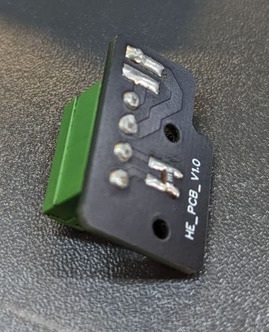
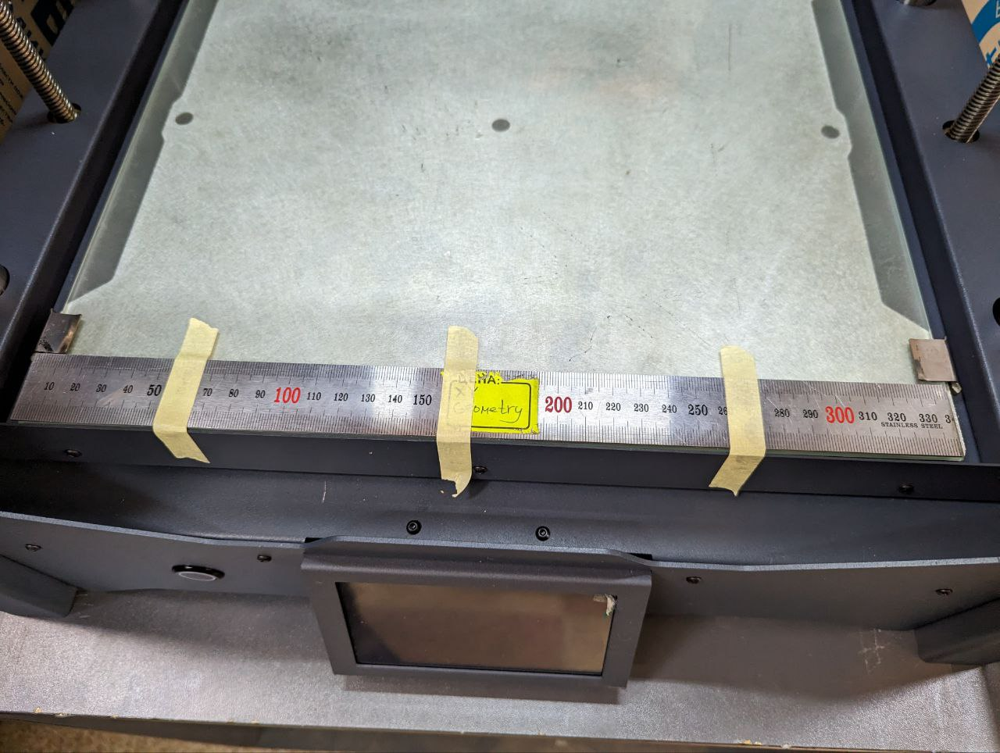
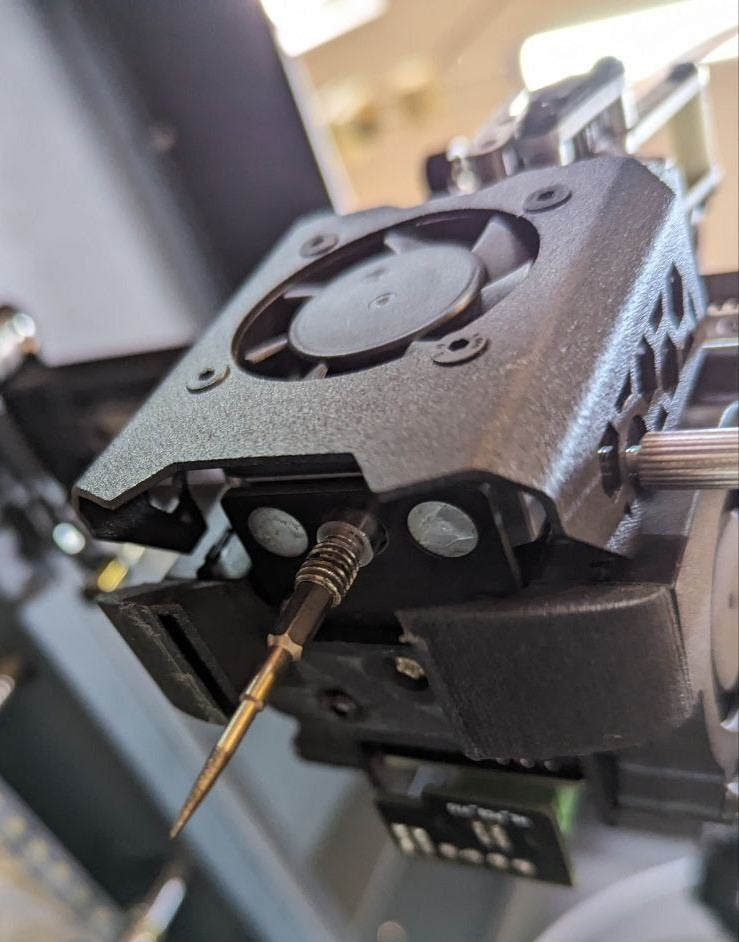

# 🔧 Корректировка шагов X Y

### Необходимая оснастка:

<table data-view="cards"><thead><tr><th></th><th></th></tr></thead><tbody><tr><td>Заглушка хотенда с иглой</td><td></td></tr><tr><td>Заглушка термистора (запаян резистор, чтобы принтер не выпадал в ошибку)</td><td></td></tr><tr><td>Специальная линейка</td><td></td></tr></tbody></table>

### Процесс корретировки&#x20;

Бумажным скотчем приклеиваем специальную линейку с передней стороне стола:

<figure><figcaption></figcaption></figure>

Вставляем заглушки хотенда и термистора в печатную голову:

<figure><figcaption></figcaption></figure>

Переходим в веб-интерфейс принтера:

<figure><figcaption></figcaption></figure>

В консоль (на скриншоте выше справа снизу) вводим команду:

```django
G28
```

После ввода команды принтер паркует все оси и приедет в левый ближний угол.

<figure><figcaption></figcaption></figure>

<figure><figcaption></figcaption></figure>

В ручном режиме двигаем стол к игле, после чего выравниваем линейку по игле, чтобы игла была ровно на линии с отметкой **10:**

<figure><figcaption></figcaption></figure>

<figure><figcaption></figcaption></figure>

<figure><figcaption></figcaption></figure>

Далее в ручном режиме двигаем ось X на 300 мм:

<figure><figcaption></figcaption></figure>

Игла должна стать напротив отметки **310:**

<figure><figcaption></figcaption></figure>

Если игла не совпала с отметкой 310, то в зависимости от случая:

* если игла зашла за отметку, то в веб-интрефейте в файле **Конфигурация->klipper-config->steppers.cfg** меняем значения **rotation\_distance** для **stepper X** и **stepper Y** в большую сторону на сотки/десятки.
* если игла не зашла за отметку, то в веб-интрефейте в файле **Конфигурация->klipper-config->steppers.cfg** меняем значения **rotation\_distance** для **stepper X** и **stepper Y** в меньшую сторону на сотки/десятки.


Занимательная страничка:

Предположительно, но не точно, изменение значение **rotation\_distance** на **0,02** изменаяет величину перемещения на **0,5 мм.**

**Требуется проверить.**


<figure><figcaption></figcaption></figure>

После изменения значения **rotation\_distance** нажимаем кнопку **Сохранить и перезагрузить** и повторяем операцию с пункта про ввод команды _**G28.**_

В итоге при перемещении на 300 мм игла должна стать ровно над риской **310** на линейке.
