# 🧺 Комплектация

## Комплектация Z-Bolt S300

В таблице ниже находится перечень для комплектации принтера Z-Bolt S300.

### 01. Перечень для комплектации

<table data-full-width="false"><thead><tr><th align="center">Изображение</th><th align="center">Название</th><th align="center">Кол-во на принтер</th></tr></thead><tbody><tr><td align="center">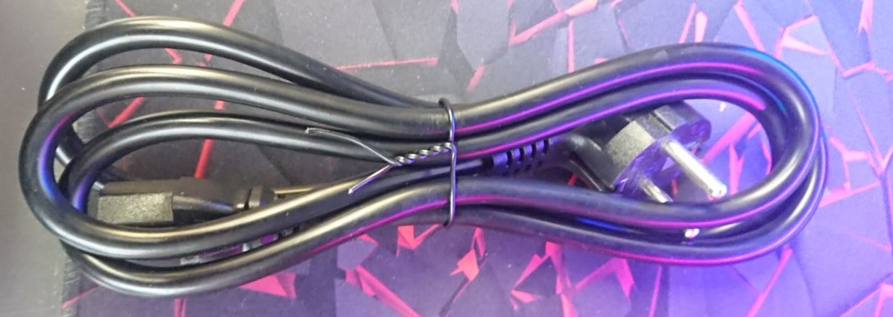</td><td align="center">Шнур питания</td><td align="center">1 шт.</td></tr><tr><td align="center">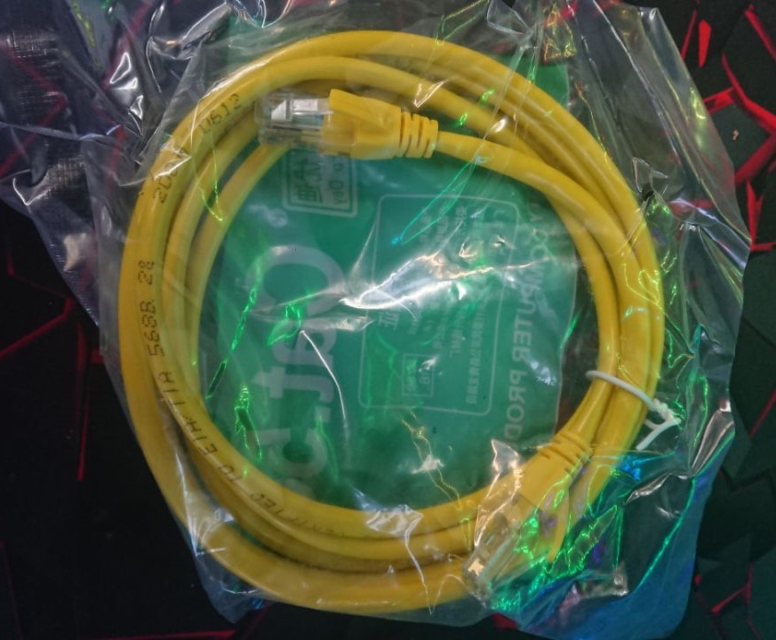</td><td align="center">Патч-корд</td><td align="center">1 шт.</td></tr><tr><td align="center">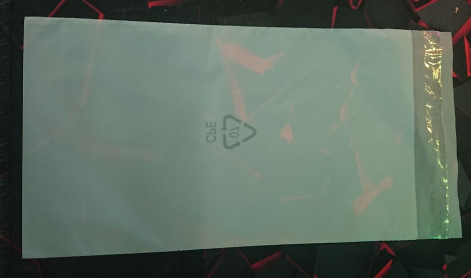</td><td align="center">Пакетик для комплектации маленький</td><td align="center">2 шт.</td></tr><tr><td align="center">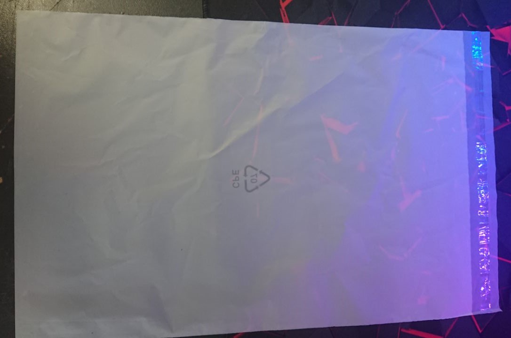</td><td align="center">Пакетик для комплектации большой</td><td align="center">2 шт.</td></tr><tr><td align="center">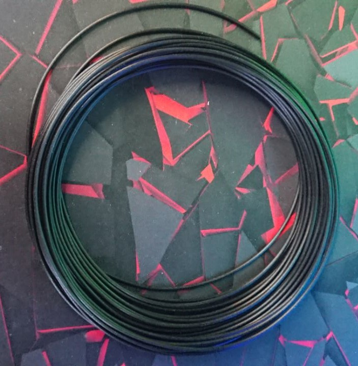</td><td align="center">
Пробник пластика

(ABS, PETG, PLA, HIPS)

На пакете пишем, что это за филамент
</td><td align="center">30 витков </td></tr><tr><td align="center"></td><td align="center">Бокорезы</td><td align="center">1 шт.</td></tr><tr><td align="center">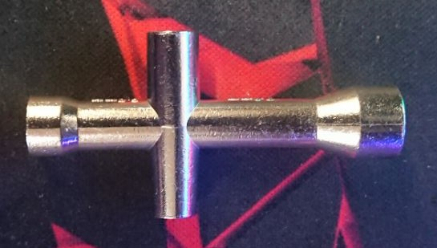</td><td align="center">
Крестовой ключик

(7мм, 5.5мм, 5мм, 4мм)
</td><td align="center">1 шт.</td></tr><tr><td align="center">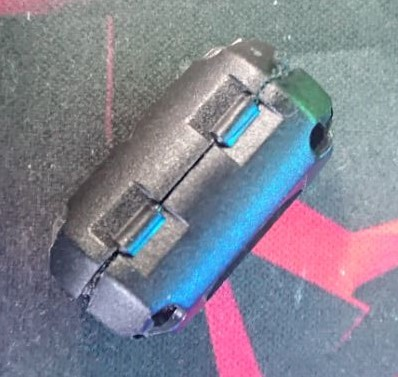</td><td align="center">Пыльник для филамента</td><td align="center">1 шт.</td></tr><tr><td align="center">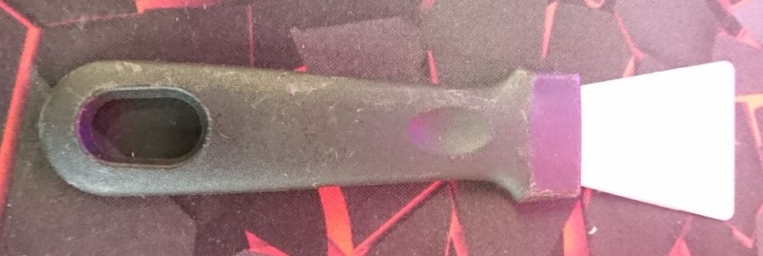</td><td align="center">Шпатель</td><td align="center">1 шт.</td></tr><tr><td align="center">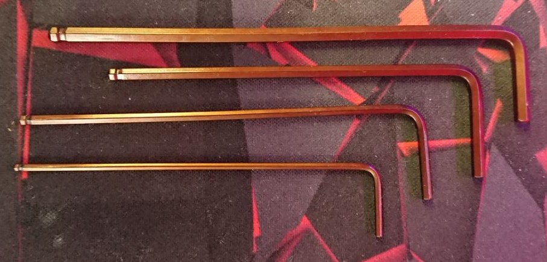</td><td align="center">
Набор воротков

(3мм, 2.5мм, 2мм, 1.5мм)
</td><td align="center">1 набор</td></tr><tr><td align="center">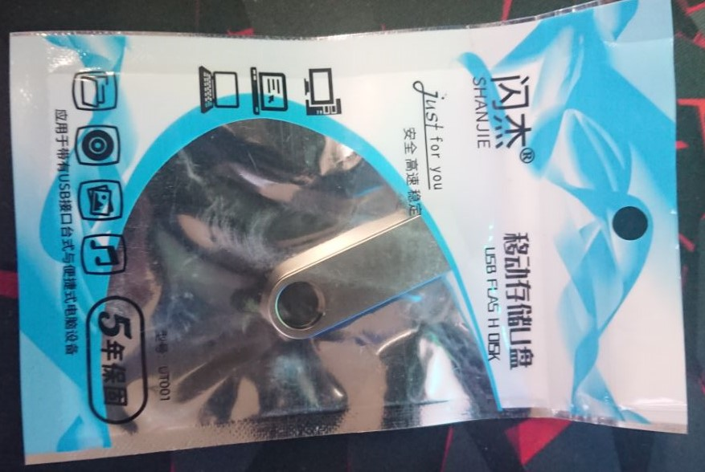</td><td align="center">
USB-Flash (FAT32, Z-Bolt)

На флешке руководство пользователя, STL кубика, установочник Cura 4.12.1 (всё это можно найти в папке 09_Delivery_kit)
</td><td align="center">1 шт.</td></tr><tr><td align="center"></td><td align="center">Ключ для смены сопел E3DV6</td><td align="center">1 шт.</td></tr><tr><td align="center">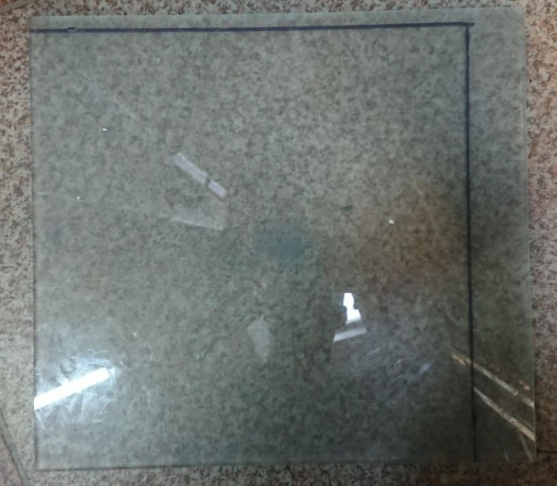</td><td align="center">Новое стекло в пупырке</td><td align="center">1 шт.</td></tr><tr><td align="center">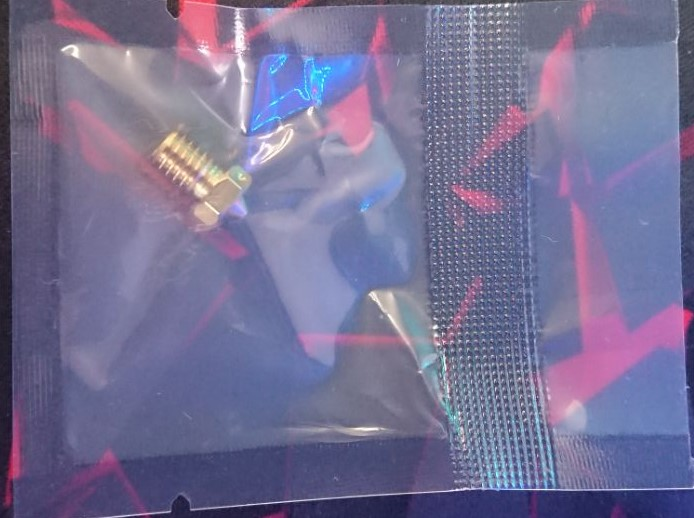</td><td align="center">Дополнительное латунное сопло E3DV6 0.4мм</td><td align="center">1 шт.</td></tr><tr><td align="center"></td><td align="center">Подшипники MR63 и MR63F</td><td align="center">по 1 шт.</td></tr><tr><td align="center"></td><td align="center">Зажимы стекла гнутые</td><td align="center">2 шт.</td></tr></tbody></table>

### 02. Процесс комплектовки

1. Берем первый маленький пакетик для комплектации и вкладываем туда:

* Бокорезы - 1 шт.
* Набор воротков (1.5, 2, 2.5, 3 мм) - 4 шт.
* Крестовой ключ - 1 шт.
* Шпатель - 1 шт.

Подписываем пакетик моделью принтера.

2. Берем второй маленький пакетик для комплектации и вкладываем туда:

* Дополнительное латунное сопло E3DV6 0.4 мм - 1 шт.
* Пыльник для филамента - 1 шт.
* Подшипники MR63-2Z и MF63 - по 1 шт.
* Ключ для смены сопел (для E3DV6) - 1 шт.
* Зажимы стекла гнутые - 2 шт.
* Доп. трубку PTFE 77 мм - 3 шт.
* USB-Flash - 1 шт.
* Доп. комплектацию клиента.

Подписываем пакетик и упаковку USB-Flash моделью принтера.

3. Берем первый большой пакетик и вкладываем туда:

* Пробник филамента - 1 шт.

Подписываем пакетик "Название филамента" + "Температура хотенда / Температура стола"

4. Берем второй большой пакетик и вкладываем туда:

* Шнур питания - 1 шт.
* Патч-корд - 1 шт.
* Большой пакетик с пробником филамента - 1 шт.
* Маленькие пакетики с комплектацией - 2 шт.

Подписываем названием модели принтера.                                                                                                                                                                                                                                                                                                                                                                                                                                                                                                                                                                                                                                                                                                                                                                                                                                                                                                                                                                                                                                                                                                                                                                                                                                                                                                                                                                                                                                                                                                                                                                                                                                                                                                                                                                                                                                                                                                                                                                                                                                                                                                                                                                                                                                                                                                                                                                                                                                                                                                    &#x20;

## Комплектация Z-Bolt S300 HT

В таблице ниже находится перечень для комплектации принтера Z-Bolt S300 HT.

### 01. Перечень для комплектации

<table data-full-width="false"><thead><tr><th align="center">Изображение</th><th align="center">Название</th><th align="center">Кол-во на принтер</th></tr></thead><tbody><tr><td align="center"></td><td align="center">Шнур питания</td><td align="center">1 шт.</td></tr><tr><td align="center"></td><td align="center">Патч-корд</td><td align="center">1 шт.</td></tr><tr><td align="center"></td><td align="center">Пакетик для комплектации маленький</td><td align="center">2 шт.</td></tr><tr><td align="center"></td><td align="center">Пакетик для комплектации большой</td><td align="center">2 шт.</td></tr><tr><td align="center"></td><td align="center">
Пробник пластика

(ABS, PETG, PLA, HIPS)

На пакете пишем, что это за филамент
</td><td align="center">30 витков </td></tr><tr><td align="center">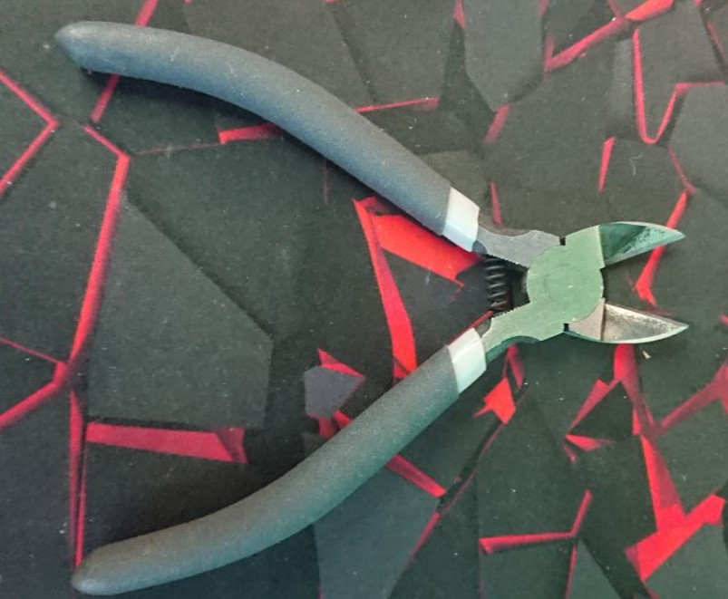</td><td align="center">Бокорезы</td><td align="center">1 шт.</td></tr><tr><td align="center"></td><td align="center">
Крестовой ключик

(7мм, 5.5мм, 5мм, 4мм)
</td><td align="center">1 шт.</td></tr><tr><td align="center"></td><td align="center">Пыльник для филамента</td><td align="center">1 шт.</td></tr><tr><td align="center"></td><td align="center">Шпатель</td><td align="center">1 шт.</td></tr><tr><td align="center"></td><td align="center">
Набор воротков

(3мм, 2.5мм, 2мм, 1.5мм)
</td><td align="center">1 набор</td></tr><tr><td align="center"></td><td align="center">
USB-Flash (FAT32, Z-Bolt)

На флешке руководство пользователя, STL кубика, установочник Cura 4.12.1 (всё это можно найти в папке 09_Delivery_kit)
</td><td align="center">1 шт.</td></tr><tr><td align="center"></td><td align="center">Ключ для смены сопел Volcano</td><td align="center">1 шт.</td></tr><tr><td align="center"></td><td align="center">Новое стекло в пупырке</td><td align="center">1 шт.</td></tr><tr><td align="center"></td><td align="center">Дополнительное латунное сопло Volcano 0.6мм</td><td align="center">1 шт.</td></tr></tbody></table>

### 02. Процесс комплектовки

1. Берем первый маленький пакетик для комплектации и вкладываем туда:

* Бокорезы - 1 шт.
* Набор воротков (1.5, 2, 2.5, 3 мм) - 4 шт.
* Крестовой ключ - 1 шт.

Подписываем пакетик моделью принтера.

2. Берем второй маленький пакетик для комплектации и вкладываем туда:

* Дополнительное латунное сопло Volcano 0.6 мм - 1 шт.
* Пыльник для филамента - 1 шт.
* Шпатель - 1 шт.
* Ключ для смены сопел (для Volcano) - 1 шт.
* Подшипники MR63 и MF63 - по 1 шт.
* Зажимы стекла - 2 шт.
* Доп. трубку PTFE 77 мм - 3 шт.
* USB-Flash - 1 шт.
* Доп. комплектацию клиента.

Подписываем пакетик и упаковку USB-Flash моделью принтера.

3. Берем первый большой пакетик и вкладываем туда:

* пробник филамента - 1 шт.

Подписываем пакетик "Название филамента" + "Температура хотенда / Температура стола".

4. Берем второй большой пакетик и вкладываем туда:

* Шнур питания - 1 шт.
* Патч-корд - 1 шт.
* Большой пакетик с пробником филамента - 1 шт.
* Маленькие пакетики с комплектацией - 2 шт.

Подписываем названием модели принтера.         &#x20;

## Комплектация Z-Bolt S300 Dual

В таблице ниже находится перечень для комплектации принтера Z-Bolt S300 Dual.

### 01. Перечень для комплектации

<table data-full-width="false"><thead><tr><th width="249.33333333333331" align="center">Изображение</th><th width="297" align="center">Название</th><th align="center">Кол-во на принтер</th></tr></thead><tbody><tr><td align="center"></td><td align="center">Шнур питания</td><td align="center">1 шт.</td></tr><tr><td align="center"></td><td align="center">Патч-корд</td><td align="center">1 шт.</td></tr><tr><td align="center"></td><td align="center">Пакетик для комплектации маленький</td><td align="center">2 шт.</td></tr><tr><td align="center"></td><td align="center">Пакетик для комплектации большой</td><td align="center">3 шт.</td></tr><tr><td align="center"></td><td align="center">
Пробник пластика

(ABS, PETG, PLA, HIPS)

На пакете пишем, что это за филамент и его температурные режимы 

</td><td align="center">
2 пробника по 30 витков

Для дуалов кладется 2 пробника из следующих комбинаций:

ABS + ABS (разных цветов)

ABS + HIPS (разных цветов)

PETG + PETG (разных цветов)

PLA + PLA (разных цветов)

PLA + PVA (разных цветов)
</td></tr><tr><td align="center"></td><td align="center">Бокорезы</td><td align="center">1 шт.</td></tr><tr><td align="center"></td><td align="center">
Крестовой ключик

(7мм, 5.5мм, 5мм, 4мм)
</td><td align="center">1 шт.</td></tr><tr><td align="center"></td><td align="center">Пыльник для филамента</td><td align="center">2 шт.</td></tr><tr><td align="center"></td><td align="center">Шпатель</td><td align="center">1 шт.</td></tr><tr><td align="center"></td><td align="center">
Набор воротков

(3мм, 2.5мм, 2мм, 1.5мм)
</td><td align="center">1 набор</td></tr><tr><td align="center"></td><td align="center">
USB-Flash (FAT32, Z-Bolt)

На флешке руководство пользователя, STL кубика, установочник Cura 4.12.1 (всё это можно найти в папке 09_Delivery_kit)
</td><td align="center">1 шт.</td></tr><tr><td align="center"></td><td align="center">Новое стекло в пупырке с вырезами под парковки</td><td align="center">1 шт.</td></tr><tr><td align="center"></td><td align="center">Дополнительное латунное сопло E3DV6 0.4мм</td><td align="center">2 шт.</td></tr></tbody></table>

### 02. Процесс комплектовки

1. Берем первый маленький пакетик для комплектации и вкладываем туда:

* Бокорезы
* Набор воротков
* Крестовой ключ
*   Подписываем пакетик моделью принтера:

    <figure><figcaption></figcaption></figure>

2. Берем второй маленький пакетик для комплектации и вкладываем туда:

* Дополнительные латунные сопла 0.4 мм - 2 шт.
* Пыльник для филамента - 1 шт.
* Шпатель - 1 шт.
* Подшипники MR63 и MF63 - по 2 шт.
* USB-Flash
* Зажимы стекла - 2 шт.
*   Подписываем пакетик и упаковку USB-Flash моделью принтера:

    <figure><figcaption></figcaption></figure>

3. Берем первый большой пакетик и вкладываем туда:

* Первый пробник филамента - 1 шт.
*   Подписываем пакетик "Название филамента" + "Температура хотенда / Температура стола"

    <figure><figcaption></figcaption></figure>

4. Берем второй большой пакетик и вкладываем тоже что и в первый.
5. Берем третий большой пакетик и вкладываем туда:

* Шнур питания - 1 шт.
* Патч-корд - 1 шт.
* Два больших пакетика с пробниками филамента - 2 шт.
* Маленькие пакетики с комплектацией - 2 шт.

Подписываем названием модели принтера.
