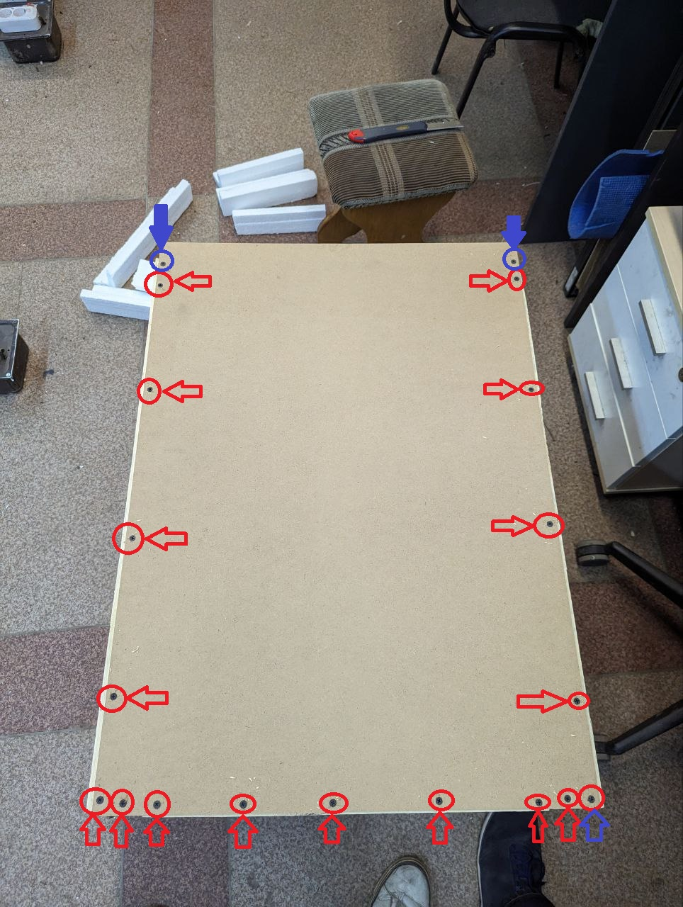
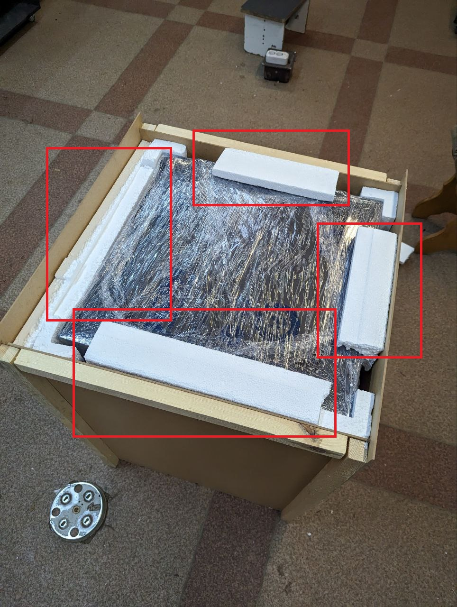

# ⏳ Упаковка принтера

## 01. Подготовка принтера

1. Пылесосим принтер и убираем остатки пластика от предыдущих печатей.
2. Вытираем остатки смазки с валов и рельс.
3. Убираем стекло внутренного пользования.
4. Если на хотенде остались следы пластика, то чистим.
5. Чистим хранилище принтера от старых g-code'ов и сбиваем пробег.
6. Фиксируем печатную голову согласно модели принтера:

Z-Bolt S300

В РАЗРАБОТКЕ...

Z-Bolt S300 HT

В РАЗРАБОТКЕ...

Z-Bolt S300 Dual

1. Фиксируем стяжкой каретку:

.png>)

2. Смотрим, чтобы концевик X не цеплялся:

.png>)

3. Фиксируем печатные головы на паковках:

.png>).png>)

7. [Проверям комплектацию](komplektaciya.md) согласно модели принтера и листу заказа.
8. Берем новое стекло или ПЕТ для модели принтера и упаковываем его в пупырку.
9. Фиксируем комплектацию к упакованному стеклу скотчем.
10. Опускаем стол принтера вниз и с помощью сборки из стяжек крепим его к столу:

<figure><figcaption>
Сборка из трех стяжек (необходимо 2 шт)
</figcaption></figure>

<figure><figcaption>
Фиксация к столу
</figcaption></figure>

11. Протираем все поликарбонатные детали от следов спиртом.
12. Заматываем принтер в стретч (должен быть полностью замотан с стретч):

<figure><figcaption></figcaption></figure>

<figure><figcaption></figcaption></figure>

## 02. Подготовка пенопласта

1. Берем лист пенопласта размерами 1000х1000х20 мм:

<figure><figcaption></figcaption></figure>

2. Разлинеиваем пенопласт так, чтобы получить прямоугольник размерами 545х580 мм после чего вырезаем его:

<figure><figcaption></figcaption></figure>

3. Берем готовые пенопластовые уголки или изготавливаем сами:

* Длинные (735 мм)  - 4 шт.

<figure><figcaption></figcaption></figure>

* Короткие (370 мм) - 4 шт.

<figure><figcaption></figcaption></figure>

## 03. Упаковка принтера

1. Берем собранную коробку:

<figure><figcaption></figcaption></figure>

2. Кладем ранее вырезанный прямоугольник (545х580мм) на дно коробки:

<figure><figcaption></figcaption></figure>

3. Ставим 2 длинных уголка к задней стенке коробки и вкладываем принтер в коробку (принтер должен прижать уголки к задней стенке):

<figure><figcaption></figcaption></figure>

4. Кладем коробку на заднюю стенку и вкладываем еще два длинных уголка:

<figure><figcaption></figcaption></figure>

5. Берем длинный кусок из остатков листа.

<figure><figcaption></figcaption></figure>

6. Обрезаем его как на фото (боковые стенки коробки необходимо прижать при принтеру):

<figure><figcaption></figcaption></figure>

<figure><figcaption></figcaption></figure>

7. Берем остаток от листа и обрезаем его как на фото и вкладываем:

<figure><figcaption></figcaption></figure>

8. Оставшийся с предыдущего пунка кусок пенопласта образаем как на фото и вкладываем:

<figure><figcaption></figcaption></figure>

9. Из маленьких остатков нарезаем кусочки и заполняем пустые пространства:

<figure><figcaption>
Возле экрана
</figcaption></figure>

<figure><figcaption>
Снаружи
</figcaption></figure>

10. Берем МДФ'ную переднюю стенку и прикручиваем ее к коробке (необходимо прижать боковые стенки к принтеру):


Где <mark style="color:red;">**красным**</mark> - Саморезы 25 мм

Где **синим** - Саморезы 55 мм


<figure><figcaption></figcaption></figure>

11. Ставим коробку на дно и укладываем 4 маленьких уголка как на фото (везде, где выделено красными квадратами, должны быть уголки):

<figure><figcaption></figcaption></figure>

12. По середине вкладываем остатки листа как на фото:

<figure><figcaption></figcaption></figure>

13. Берем верхнюю крышку и прикручиваем ее к коробке (смотрим, чтобы со всех сторон равномерно выступали бруски коробки):


Где <mark style="color:red;">**красным**</mark> - Саморезы 25 мм

Где <mark style="color:blue;">**синим**</mark> - Саморезы 55 мм


<figure><figcaption></figcaption></figure>

14. Прикручиваем верхнюю крышку с торцов коробки (саморезы 25 мм):

<figure><figcaption></figcaption></figure>

15. После всех операций маркером делаем надпись "ВЕРХ" на верхней крышке и надпись "ВЕРХ" со стрелочками, направленными к верхней крышке со всех сторон, кроме дна:

<figure><figcaption></figcaption></figure>


**ОПЦИОНАЛЬНО, ЕСЛИ ПАКУЕМ МНОГО ПРИНТЕРОВ, ЧТОБЫ НЕ ЗАПУТАТЬСЯ**

Клеим наклейку на верхнюю крышку с последними тремя цифрами серийника.

