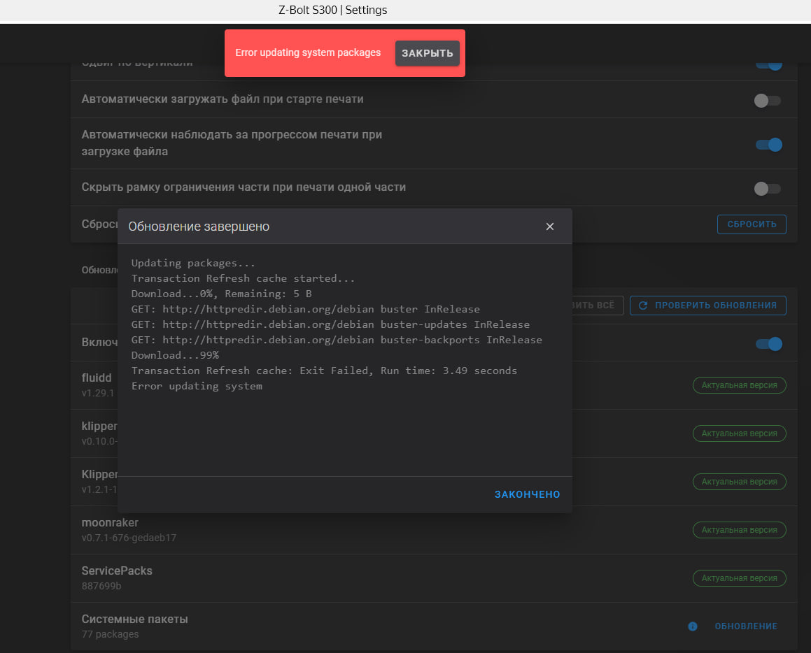

# 🆘 Техподдержка

## Перестает запускаться KlipperScreen или отрубается через несколько минут после включения

<mark style="background-color:red;">**Проблема:**</mark>

Забито внутреннее хранилище принтера.

<figure><figcaption></figcaption></figure>

<mark style="background-color:green;">**Решение:**</mark>

Очистить внутреннее хранилище принтера от больших g-кодов, таймлапсов.


## Ошибка при системных обновлениях "Error updating system package"

<mark style="background-color:red;">**Проблема:**</mark>

При обновлении системных пакетов вылетает ошибка "Error updating system package".

<figure><figcaption></figcaption></figure>

<mark style="background-color:green;">**Решение:**</mark>

Подключаемся по SSH.

Открываем файл командой:

```bash
sudo nano /etc/apt/source.list
```

В файле необходимо закомментировать строчку как на фото ниже:

<figure><figcaption></figcaption></figure>

Сохраняем и выходим: Ctrl+S, Ctrl+X.

Повторно запускаем обновление.


## Ошибка moonraker при запуске принтера

<mark style="background-color:red;">**Проблема:**</mark>

При запуске принтера появляется такое сообщение.

<figure><figcaption></figcaption></figure>

<mark style="background-color:green;">**Решение:**</mark>

<figure><figcaption></figcaption></figure>

Спрашиваем, подключена ли флешка.

Если да, то пусть меняет или форматирует, так как ошибка в чтении

